# chaosrack

**An analog computer in the browser** — a rack of instruments for dynamical
systems and live signals, rendered in real time by a Go→WebAssembly core and
driven from an analog-equipment control surface: knobs with fine-trim rings,
seven-segment LED readouts, toggle switches, concentric selector dials.

**[Live demo](https://0magnet.github.io/chaosrack/)** — the whole rack in a tab: pick a model, turn the knobs, rotate the scene.

**66 models in five kinds**, and they are no longer mostly attractors.
Continuous **flows** — Lorenz, Rössler, Chua and the rest of the classics,
plus all twenty of J. C. Sprott's 1994 cases. Discrete **maps**, which have
no dt and no path between iterates: Hénon, Ikeda, Clifford, de Jong,
Gumowski–Mira, Tinkerbell, and Chirikov's area-preserving standard map.
**Parametric** figures, and a **sequence walk** that draws arithmetic rather
than integrating anything — and can be given weight and dropped on the floor,
where a rigid-body solver lets it land, slide and settle. **Geometry and
solids**, including the rack's own panels as printable STL, and a **terminal**
running a real Bash shell in the page, which you can rotate while it runs — and
a whole **desk** you can rotate and still work in. And
**live audio** — as a spectrogram, on an XY scope, or read back as an
attractor through a delay embedding.

Rotate and zoom them, **type your own system** — as derivatives or as a map —
route audio into any parameter, **measure whether what you are looking at is
actually chaotic** by its largest Lyapunov exponent, paint with persistence,
or flip the Model Out ring and **hear the system itself**. An homage to the
analog computers at [glensstuff.com](https://glensstuff.com).

**Live:** [0magnet.github.io/chaosrack](https://0magnet.github.io/chaosrack/) · [tinygo build](https://0magnet.github.io/chaosrack/tinygo/)

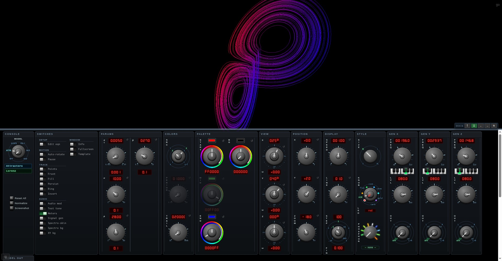

## Contents

<!-- BEGIN TOC -->

<!-- generated by `uitool readme` — do not edit by hand -->
- [Contents](#contents)
- [Run](#run)
  - [Serverless](#serverless)
- [What's inside](#whats-inside)
- [Models](#models)
  - [Attractors](#attractors)
  - [Sprott systems (1994)](#sprott-systems-1994)
  - [Maps](#maps)
  - [Scope](#scope)
  - [Polyhedra](#polyhedra)
  - [Geometry](#geometry)
  - [Sequences](#sequences)
  - [Solids](#solids)
  - [Audio](#audio)
  - [Analysis](#analysis)
  - [Custom](#custom)
- [Reaching the machine](#reaching-the-machine)
  - [On a machine with other people on it](#on-a-machine-with-other-people-on-it)
- [The rack](#the-rack)
  - [Console](#console)
  - [Parameters](#parameters)
  - [Colors](#colors)
  - [Palette](#palette)
  - [Record](#record)
  - [View](#view)
  - [Position](#position)
  - [Display](#display)
  - [Style](#style)
  - [Gen X](#gen-x)
  - [Gen Y](#gen-y)
  - [Gen Z](#gen-z)
  - [Envelope](#envelope)
  - [Model Out](#model-out)
  - [Patchbay](#patchbay)
  - [Mod](#mod)
  - [EQ](#eq)
  - [Analysis](#analysis-1)
  - [Presets](#presets)
  - [Counter](#counter)
  - [Keys](#keys)
  - [Matrix](#matrix)
  - [Template](#template)
- [Physical dimensions](#physical-dimensions)
- [Solid models (STL)](#solid-models-stl)
- [Recording](#recording)
- [Gallery](#gallery)
  - [Animated tour](#animated-tour)
  - [The control surface](#the-control-surface)
  - [Chaos monkey jam sessions](#chaos-monkey-jam-sessions)
  - [Contact sheets (stills)](#contact-sheets-stills)
- [Audio](#audio-1)
- [FVF — Harmonic Wobbulator](#fvf--harmonic-wobbulator)
- [Testing & tooling](#testing--tooling)
- [Build](#build)
- [Related / prior art](#related--prior-art)
- [Dependency Graph](#dependency-graph)
- [Lines of Code](#lines-of-code)

<!-- END TOC -->

## Run

No build step — the WebAssembly is embedded in the server binary:

```
go run github.com/0magnet/chaosrack@master
```

Then open:
* [127.0.0.1:8080/](http://127.0.0.1:8080/) — standard Go build
* [127.0.0.1:8080/tinygo/](http://127.0.0.1:8080/tinygo/) — smaller TinyGo build

(The same entrypoint is also at `github.com/0magnet/chaosrack/cmd/chaosrack`.)

### Serverless

The wasm is **gzipped, then base64'd** into a single self-contained HTML file,
so it also runs straight from static hosting with no server:
* [index.html](index.html) · [tinygo/index.html](tinygo/index.html)

Gzipping first matters more than it sounds. A 6 MB wasm base64s to 8.4 MB of
JavaScript source that the browser must receive, parse and `atob` before
anything starts; gzipped it is 2.2 MB. The page went from 10.2 MB to 3.3 MB
(TinyGo's from 2.2 MB to 0.9 MB) and the time from reload to a built panel
from about seven seconds to two. `DecompressionStream` does the inflating —
no library, present since Chrome 80, Firefox 113 and Safari 16.4 — and where
it is missing the served page falls back to fetching `/chaosrack.wasm` as an
ordinary resource.

## What's inside

- **Flows — the continuous catalog:** Lorenz, Rössler, Chua, Aizawa, Thomas,
  Halvorsen, Chen, Dadras, Rabinovich–Fabrikant, Burke–Shaw, Lü,
  Newton–Leipnik, the 4-D **hyperchaotic Rössler**, and all of **J. C.
  Sprott's cases A–S** — plus Lissajous, the Graphic Artist (four-oscillator
  XY art), platonic solids and geometric primitives. Every built-in flow's
  default parameters are **certified chaotic in CI** by a Lyapunov-exponent
  test run under the app's own integrator (a periodic-window default shipped
  once; never again).
- **Maps — the discrete catalog:** Hénon, Ikeda, Clifford, de Jong,
  Gumowski–Mira, Tinkerbell and the **Chirikov standard map**. A map is not a
  slow flow: there is no dt and no trajectory *between* iterates, so they are
  drawn as points — joining consecutive iterates of a chaotic map would
  scribble a hairball across the very structure the map exists to show.
  Hénon's determinant is −b everywhere and Chirikov's is exactly 1, and both
  are asserted in the tests, because a mistyped coefficient looks plausible
  and measures wrong. The standard map is the one system here with **no
  attractor at all** — being area-preserving, nothing contracts onto
  anything — so it is drawn as an ensemble of orbits rather than one, and you
  can watch the invariant curves break into a chaotic sea as K passes 0.9716.
- **A shell, three ways.** The **Terminal** model puts
  [websh](https://github.com/0magnet/websh) — a Bash interpreter compiled to
  wasm — on a quad *inside* the scene, so a running `for` loop rotates and
  zooms like any other model; double-click to type, `Esc` to give the keyboard
  back. The **Desk** switch is the other arrangement: a
  [window manager](https://github.com/0magnet/desk) floating *over* the scene,
  with terminals and a file manager in real windows, and the model still
  integrating behind them — not a wallpaper but a system you can keep tuning
  from the rack while you work on top of it. Dragging where there is no window
  still rotates what is underneath. And the **Desk** *model* is the third: the
  whole window manager on a quad, inside the scene, rotating with everything
  else. That one needed something from desk to be possible at all — a window is
  more than its pane, and its title, buttons and border are DOM, which cannot be
  sampled into a texture — so desk's compositor now *redraws* the frames with
  Canvas2D into the canvas it already draws the panes into, and chaosrack
  samples that. Nothing types into it while it is a model: use the switch to
  work in the windows, the model to look at them. **Contain** is the fourth and
  turns the whole thing inside out — the desk becomes the environment and
  chaosrack a window *on* it, minimizing to the desk's panel like anything else,
  with the model still running behind.
- **Optionally, your actual machine.** Everything above runs in the tab and
  touches nothing. Two flags change that, and both are off:
  `chaosrack --shell` puts a **host shell** app in the desk — xterm-go attached
  over a WebSocket to a pty running your `$SHELL`, resizing with the window
  because a resize becomes a `TIOCSWINSZ` and so a `SIGWINCH`. `chaosrack --fs`
  is the one that does more than it looks like: websh's shell and the file
  manager both work against an `afero.Fs`, so a single host-backed
  implementation makes `ls`, `cat`, `grep`, globbing and redirection all land
  on the real filesystem while the interpreter stays in the tab. `--fs-root`
  confines it. See [Reaching the machine](#reaching-the-machine).
- **Four 3-D desktops, reproduced.** Putting windows in three dimensions is
  not a new idea and the good ones are not mine, so the desk can wear four of
  them: **Looking Glass** (Sun, 2003) leans the windows into a legible stack
  and lets you turn one over and read its back; the **Cube** (Compiz, 2006)
  hangs workspaces on the faces of a cube the arrow keys spin; **Metisse**
  (2004) lets you shift-drag a window to any angle and keep typing into it;
  and **BumpTop** (2009) gives the windows weight and drops them into a pile
  on top of the rack. They are reproductions rather than pictures — the
  windows are real, the shells in them are running, and a window turned forty
  degrees still takes the keyboard, because a CSS 3-D transform is a real
  projection and the browser hit-tests what it draws.
- **Analysis — is this actually chaotic?** The **largest Lyapunov exponent**
  of whatever is on screen, measured on demand by the same estimator that
  guards the catalog's defaults in CI, with a plain-language verdict beside
  the number. Flows report per unit time and maps per iterate, and the readout
  says which, because 0.42 per second and 0.42 per iterate are not comparable.
  A polyhedron reports "no dynamics" rather than a decimal. It earns its place
  most in Custom mode: type a system and *read* whether you found chaos
  instead of guessing from the picture. Alongside it, a **bifurcation
  explorer** and a **recurrence plot**.
- **Turtle Path — a model that is arithmetic, not a flow:** reduce an integer
  sequence modulo *m* and the remainders repeat; the length of the repeat is
  the **Pisano period**. Read each term as turn-and-step and the walk draws a
  figure. In **DIM 3** the parity of the term still picks left or right and the
  parity of the *next* term picks yaw or pitch — reading the pair, because
  (Fₙ, Fₙ₊₁) mod *m* is the state of the recurrence and the Pisano period is
  the period of that pair. One pass decides the rest: the figure closes, drifts
  in a straight line, or screws away along an axis, and the Info overlay says
  which. Space adds two outcomes the plane cannot have — a helix, and closure
  after exactly three passes, from a rotation about a body diagonal. **The walk
  never finishes, and is never restarted:** the turtle is held mid-stride and
  extended at the Speed knob's rate, forever, with the oldest of the trail
  falling off the far end as new steps arrive — so a closed figure stands still
  while the color moves through it and an open one keeps walking into new
  territory. Because a step walked twice is a different fact about
  the figure than a step walked once, it comes back in a different color; the
  figure changes while you watch it. **TINT** is what a color means (step, pass,
  visits, heading, turn, term, age), **TRAIL** how much stays on screen (whole,
  long, short, comet), **CAM** where it is watched from — including **lock**, which
  cancels the drift and centers on the screw axis, both worked out exactly by
  the classification, so the figure stands still and turns on the spot while
  the walk runs through it, the way a scope's timebase holds a waveform — **CYCLE** steps to the next modulus on its own — and **PHYS** gives
  the figure weight, making it a rigid body in the plane of the screen inside a
  solid box the size of the frame — it falls, tips, settles, and can be picked
  up and thrown with the mouse (press on the figure to move it, beside it to
  turn the view). The walk keeps extruding at the head while the tail drops
  away, so the figure slides through its own body and marches. An analog
  computer was a physics simulator; GRAV — either way up — FRIC, BOUNCE and
  SPIN are the coefficients it would have been patched with. Powered by
  [0magnet/pisano](https://github.com/0magnet/pisano), whose command-line flags
  these knobs are.
- **Custom equation mode:** type `dx/dt`, `dy/dt`, `dz/dt` (and an optional
  4th dimension); every parameter you name automatically gets a control knob.
  `Edit eqn` seeds the editor from any built-in system. Flip **iterate** and
  the same expressions are read as a discrete map instead — `x = f(x,y,z)`
  rather than `x += dt·f` — so you can type Hénon as easily as Lorenz. The dt
  knob goes away, because a map has no timestep, and the typed system is
  published as a map rather than as a flow: everything downstream of the flow
  registry integrates what it finds, and read as a derivative Hénon's
  `1 − 1.4x² + y` is a slow crawl to a fixed point rather than the fractal on
  screen.
- **Two trail engines:** classic **scan** (the whole curve re-integrates every
  frame, so parameter and audio changes reshape it instantly) and the
  **Ring** switch's scope-style beam (only the advancing head integrates; the
  trail is its history, and knob changes bend the path from the head forward).
  **Persist** accumulates either into a long-exposure painting.
- **Colors module:** gradient source ring (X / Y / Z / trail) × palette ring
  (mono / 2-color / 3-color / animated rainbow), color-wheel knobs for the
  gradient stops and background, CRT **phosphor** presets (P31/P7/P33…) with
  afterglow for the scope modes.
- **Model Out — hear the attractor:** the trail plays through the speakers.
  **FLOW** integrates the same vector field the renderer draws at audio rate,
  so the pitch is the system's *own* orbital frequency — chaos chirps,
  periodic windows lock into tones, parameter changes are audible
  bifurcations — with a RATE knob that transposes in exact musical intervals.
  **SCAN** traces the drawn trail as a wavetable at an exact concert-pitch
  rate. The MAP ring picks the stereo projection (CAM = the screen's x/y, so
  rotating the model changes the sound).
- **Signal generators:** three oscillators (sine/tri/square/saw) on a
  concert-pitch A0–A10 scale with octave dials and a clickable piano-key
  register display, routable to either speaker channel — and usable as the
  audio source for every audio-reactive feature, no server needed.
- **Two transports for the audio:** the WebSocket carries little-endian
  float32 samples in binary frames — it used to base64 them into text frames,
  which cost 4/3 of the bytes plus an encode and a decode per chunk for
  nothing. **WebTransport** (HTTP/3 over QUIC) is there as an option for the
  link that drops packets: it sends the same bytes as unreliable DATAGRAMS,
  so a lost packet costs exactly the ~12 ms it carried instead of stalling
  the feed for a round trip while TCP retransmits. Over loopback that buys
  nothing and the WebSocket stays the default; the payoff is a remote link.
  Unsupported browser, no server support, or a refused certificate all fall
  back to the WebSocket and say so.
- **Live audio, read as an attractor:** the **Takens embedding** turns a
  single signal back into a manifold — the delay vector (s(t), s(t−τ),
  s(t−2τ)) reconstructs something diffeomorphic to whatever produced it, so a
  pure tone draws a closed loop and music traces the geometry of the music.
  τ is the one parameter that matters and it used to be a rule of thumb; the
  **MEAS** button now measures it — the first minimum of the signal's average
  mutual information — along with the false-nearest-neighbor dimension. Once,
  on a button, deliberately: a knob that re-tuned itself every frame made the
  figure move with the music, which is the opposite of showing you its shape.
- **Shareable permalinks** capture the full state — mode, parameters,
  equations, colors, pose, audio-mod routing — in the URL, round-trip-tested.
  The same serialization backs **named presets**: save the view you are
  looking at, recall it later, without the address bar having to carry it.
  The rack remembers itself too — which modules are out, and in what order.
- **The rack rearranges:** every module has a switch in the Console's Modules
  section (the Console has none — it is where the switches live, so it is the
  one module that cannot be put away), and a module's header is a handle: drag
  it and it settles into whatever gap you drop it in. The tiling and the
  docking are their own libraries now — [rack-go](https://github.com/0magnet/rack-go)
  and [winbox-go](https://github.com/0magnet/winbox-go). Every module is
  pictured in [The rack](#the-rack).
- **Record what you see:** the [Record module](#recording) is a capture deck
  with a monitor — WebM through `MediaRecorder` or a GIF encoded in Go, the
  whole canvas or a rectangle you drag out of it, with a transport, a
  timecode, a media-size readout and a single-frame still button.
- **The spectrogram is the real one:** transform size, overlap, window
  function, magnitude scale and limits, and color scheme are all on the panel,
  matching [audioprism-go](https://github.com/0magnet/audioprism-go) — itself a
  Go port of vsergeev's audioprism, and the reference this was checked against
  frame by frame.
- **Fit and finish:** the control panel docks to any edge or floats, the
  whole interface scales, knobs come in six styles, a Template module
  documents every module slot, and rendering is devicePixelRatio-native.

## Models

<!-- BEGIN MODELS -->

Every position of the model selector, in the order the knob turns through
them. A model that appears under two categories — the XY scope and the
Takens embedding are each both a Scope and an Audio model — is listed under
both, because that is what the selector does.

Each entry is captured from the running app by `uitool portraits`: a still,
a loop turning through all four positions of the palette knob, and the
**Parameters module as it stands for that model** — the knobs are the
system's own, so Lorenz's σ/ρ/β and the turtle's mod/seq/dim are different
panels under the same header. A model with no parameters of its own has no
such column. The prose is the same text the Info overlay shows.

### Attractors

[Rossler](#rossler) · [Lorenz](#lorenz) · [Chua](#chua) · [Aizawa](#aizawa) · [Sprott](#sprott) · [Thomas](#thomas) · [Halvorsen](#halvorsen) · [Chen](#chen) · [Dadras](#dadras) · [Rabinovich-Fabrikant](#rabinovich-fabrikant) · [Burke-Shaw](#burke-shaw) · [Lü](#lü) · [Newton-Leipnik](#newton-leipnik) · [Hyper-Rössler (4D)](#hyper-rössler-4d)

#### Rossler

| Rossler | turning | parameters |
| --- | --- | --- |
| 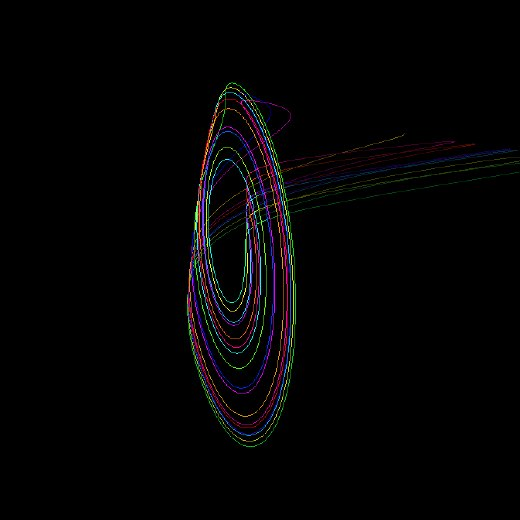 | 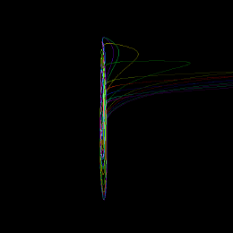 |  |

Rössler Attractor — Proposed by Otto Rössler in 1976 as a simpler system that produces chaotic behavior. Unlike the Lorenz system's two-lobed shape, the Rössler attractor has a single folded-band structure with an outward spiral that occasionally makes a large excursion in the z-direction.

```
dx/dt = −(y + z)
dy/dt = x + ay
dz/dt = b + z(x − c)
```

`#rossler` · 3-D flow

#### Lorenz

| Lorenz | turning | parameters |
| --- | --- | --- |
| 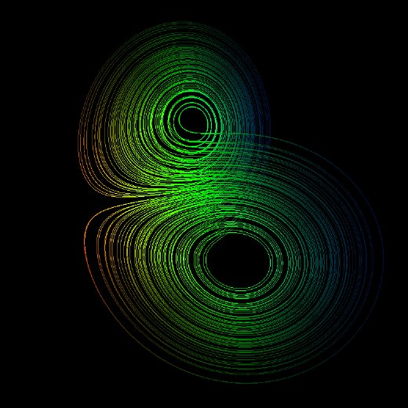 | 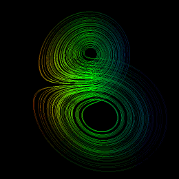 | 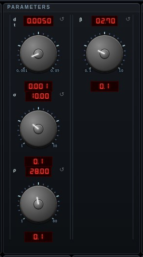 |

Lorenz Attractor — Discovered by Edward Lorenz in 1963 while modeling atmospheric convection. The butterfly-shaped trajectory arises from a simplified system of three coupled differential equations. It was one of the first systems shown to exhibit deterministic chaos, where tiny differences in initial conditions lead to vastly different outcomes.

```
dx/dt = σ(y − x)
dy/dt = x(ρ − z) − y
dz/dt = xy − βz
```

`#lorenz` · 3-D flow

#### Chua

| Chua | turning | parameters |
| --- | --- | --- |
| 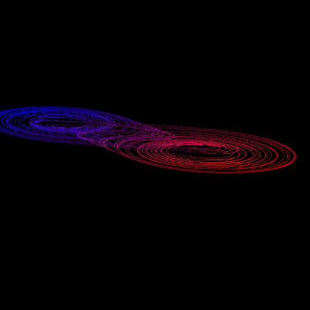 | 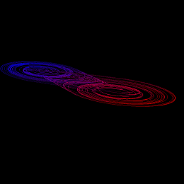 | 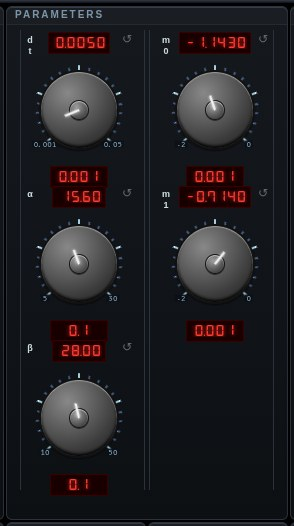 |

Chua's Circuit (Double Scroll Attractor) — Invented by Leon Chua in 1983, this is the first electronic circuit proven to exhibit chaos. The system features a piecewise-linear nonlinearity (the Chua diode) that creates the characteristic double-scroll pattern. It is also the basis for multi-scroll attractor generalizations.

```
dx/dt = α(y − x − h(x))
dy/dt = x − y + z
dz/dt = −βy
h(x) = m₁x + ½(m₀ − m₁)(|x+1| − |x−1|)
```

`#chua` · 3-D flow

#### Aizawa

| Aizawa | turning | parameters |
| --- | --- | --- |
| 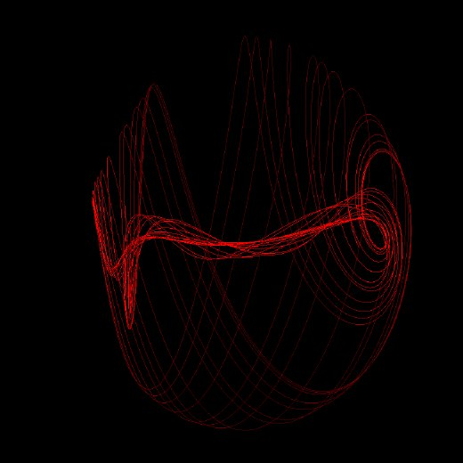 | 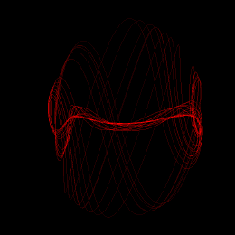 | 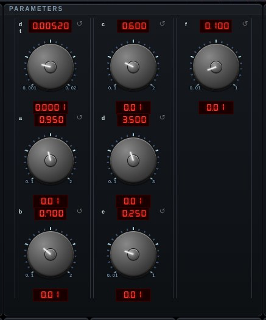 |

Aizawa Attractor — A chaotic system that produces a toroidal structure with a tendril extending from the center. The attractor has a visually striking shape that resembles a sphere with a tail, exhibiting both rotational symmetry and chaotic wandering.

```
dx/dt = (z − b)x − dy
dy/dt = dx + (z − b)y
dz/dt = c + az − z³/3 − (x² + y²)(1 + ez) + fzx³
```

`#aizawa` · 3-D flow

#### Sprott

| Sprott | turning | parameters |
| --- | --- | --- |
| 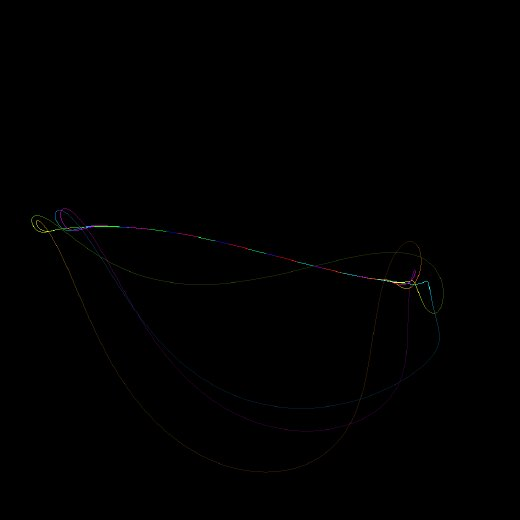 | 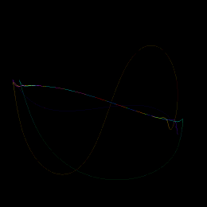 | 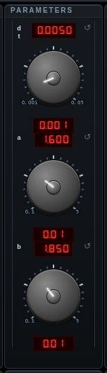 |

Sprott Attractor — One of many simple chaotic systems cataloged by Julien Clinton Sprott. These systems were discovered through systematic computer searches for chaotic flows with minimal terms, demonstrating that chaos can arise from remarkably simple equations.

```
dx/dt = y + Axy + xz
dy/dt = 1 − Bx² + yz
dz/dt = x − x² − y²
```

`#sprott` · 3-D flow

#### Thomas

| Thomas | turning | parameters |
| --- | --- | --- |
| 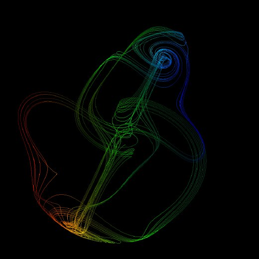 | 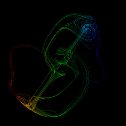 | 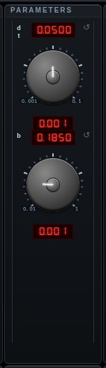 |

Thomas' Cyclically Symmetric Attractor — Introduced by René Thomas, this system has the elegant property of cyclic symmetry: each variable is damped and driven by the sine of the next variable in the cycle. The parameter b controls dissipation; as b decreases the system transitions from stable points through limit cycles to chaos.

```
dx/dt = −bx + sin(y)
dy/dt = −by + sin(z)
dz/dt = −bz + sin(x)
```

`#thomas` · 3-D flow

#### Halvorsen

| Halvorsen | turning | parameters |
| --- | --- | --- |
| 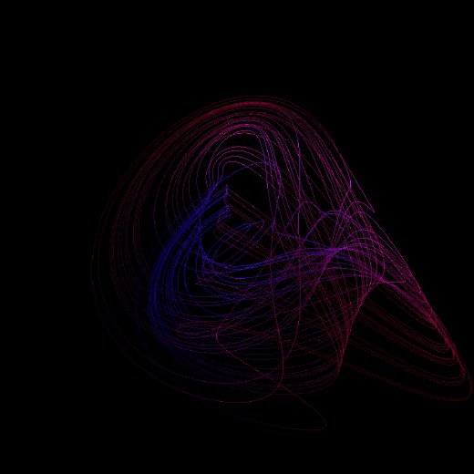 | 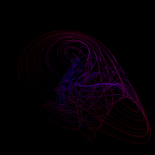 | 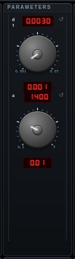 |

Halvorsen Attractor — A chaotic system with three-fold rotational symmetry, producing a distinctive pinwheel-like shape. The attractor consists of three intertwined lobes that spiral around each other, creating a visually complex but structurally symmetric trajectory.

```
dx/dt = −ax − 4y − 4z − y²
dy/dt = −ay − 4z − 4x − z²
dz/dt = −az − 4x − 4y − x²
```

`#halvorsen` · 3-D flow

#### Chen

| Chen | turning | parameters |
| --- | --- | --- |
| 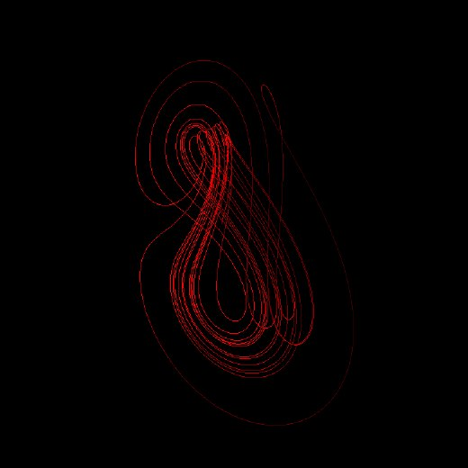 | 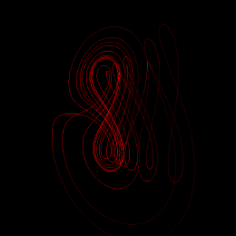 |  |

Chen Attractor — Discovered by Guanrong Chen in 1999, this system was found as a dual of the Lorenz system in a specific mathematical sense. It exhibits chaotic behavior with a distinctive two-scroll structure that differs from both the Lorenz and Rössler attractors.

```
dx/dt = a(y − x)
dy/dt = (c − a)x − xz + cy
dz/dt = xy − bz
```

`#chen` · 3-D flow

#### Dadras

| Dadras | turning | parameters |
| --- | --- | --- |
| 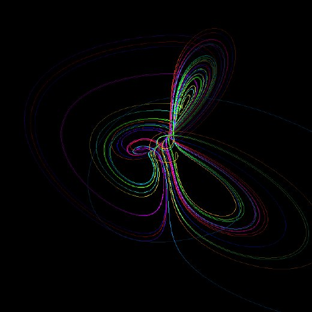 | 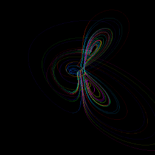 | 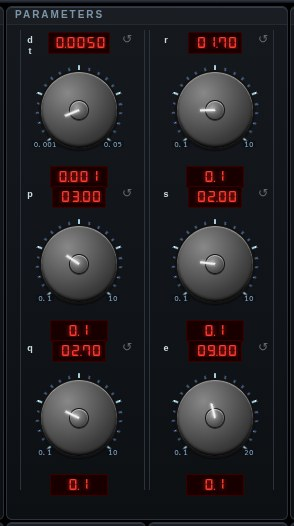 |

Dadras Attractor — A three-dimensional autonomous chaotic system with five parameters, introduced by Sara Dadras and Hamid Reza Momeni. The system exhibits rich dynamical behavior including period-doubling routes to chaos.

```
dx/dt = y − px + qyz
dy/dt = ry − xz + z
dz/dt = sxy − ez
```

`#dadras` · 3-D flow

#### Rabinovich-Fabrikant

| Rabinovich-Fabrikant | turning | parameters |
| --- | --- | --- |
| 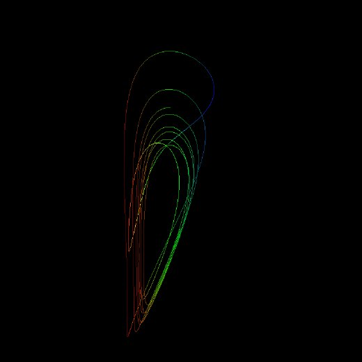 | 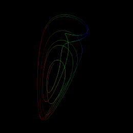 | 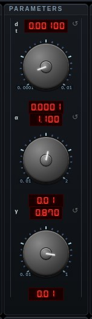 |

Rabinovich-Fabrikant Attractor — Derived by Mikhail Rabinovich and Anatoly Fabrikant from physical equations modeling the stochasticity of three interacting waves. The system is known for its complex topology and extreme sensitivity to parameters, producing intricate folded structures.

```
dx/dt = y(z − 1 + x²) + γx
dy/dt = x(3z + 1 − x²) + γy
dz/dt = −2z(α + xy)
```

`#rabinovich` · 3-D flow

#### Burke-Shaw

| Burke-Shaw | turning | parameters |
| --- | --- | --- |
| 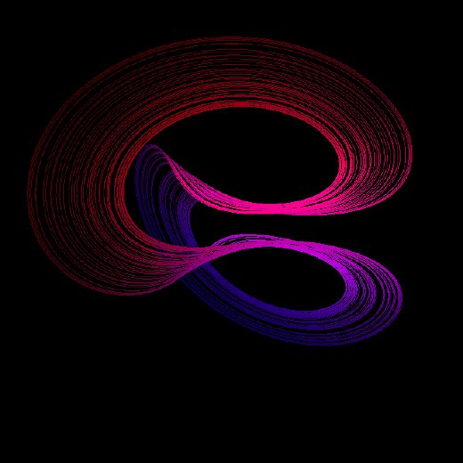 | 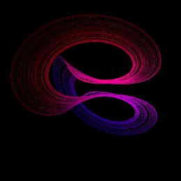 | 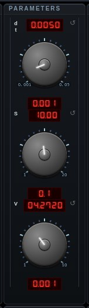 |

Burke-Shaw Attractor — Introduced by Bill Burke and Robert Shaw, this system exhibits chaotic behavior with a distinctive two-winged structure. It arises from the study of nonlinear dynamics and produces complex trajectories confined to a compact region of phase space.

```
dx/dt = −S(x + y)
dy/dt = −y − Sxz
dz/dt = Sxy + V
```

`#burkeshaw` · 3-D flow

#### Lü

| Lü | turning | parameters |
| --- | --- | --- |
| 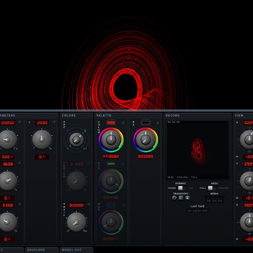 | 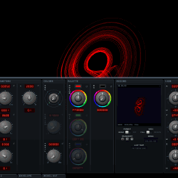 | 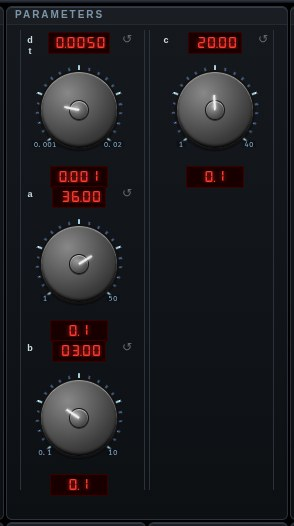 |

Lü Attractor — Discovered by Jinhu Lü and Guanrong Chen (2002), the third member of the Lorenz–Chen–Lü family; it forms a bridge between the Lorenz and Chen systems and produces a two-scroll butterfly.

```
dx/dt = a(y − x)
dy/dt = cy − xz
dz/dt = xy − bz
```

`#lu` · 3-D flow

#### Newton-Leipnik

| Newton-Leipnik | turning | parameters |
| --- | --- | --- |
| 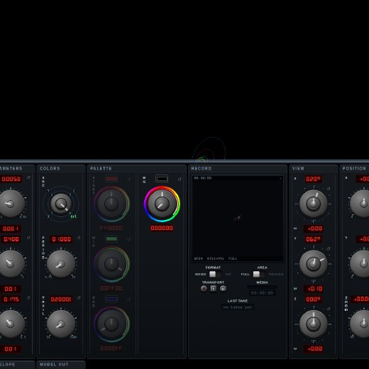 | 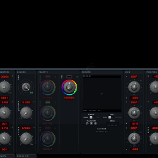 | 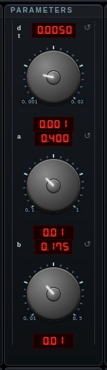 |

Newton–Leipnik Attractor — Arises from a rigid-body rotation model with a linear feedback torque; it has two coexisting scroll-shaped attractors.

```
dx/dt = −ax + y + 10yz
dy/dt = −x − 0.4y + 5xz
dz/dt = bz − 5xy
```

`#newtonleipnik` · 3-D flow

#### Hyper-Rössler (4D)

| Hyper-Rössler (4D) | turning | parameters |
| --- | --- | --- |
|  | 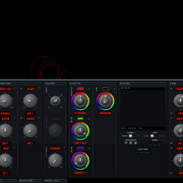 | 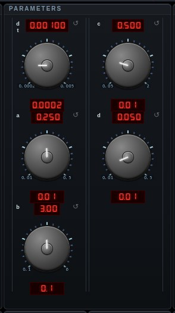 |

Rössler Hyperchaos (1979) — Otto Rössler's 4-dimensional extension of his attractor, with two positive Lyapunov exponents (hyperchaos). A hidden fourth coordinate w feeds back into y; the plot is the (x,y,z) projection.

```
dx/dt = −y − z
dy/dt = x + ay + w
dz/dt = b + xz
dw/dt = −cz + dw
```

`#hyperrossler` · 4-D flow

### Sprott systems (1994)

[Sprott Morph](#sprott-morph) · [Sprott A](#sprott-a) · [Sprott B](#sprott-b) · [Sprott C](#sprott-c) · [Sprott D](#sprott-d) · [Sprott E](#sprott-e) · [Sprott F](#sprott-f) · [Sprott G](#sprott-g) · [Sprott H](#sprott-h) · [Sprott I](#sprott-i) · [Sprott J](#sprott-j) · [Sprott K](#sprott-k) · [Sprott L](#sprott-l) · [Sprott M](#sprott-m) · [Sprott N](#sprott-n) · [Sprott O](#sprott-o) · [Sprott P](#sprott-p) · [Sprott Q](#sprott-q) · [Sprott R](#sprott-r) · [Sprott S](#sprott-s)

#### Sprott Morph

| Sprott Morph | turning | parameters |
| --- | --- | --- |
| 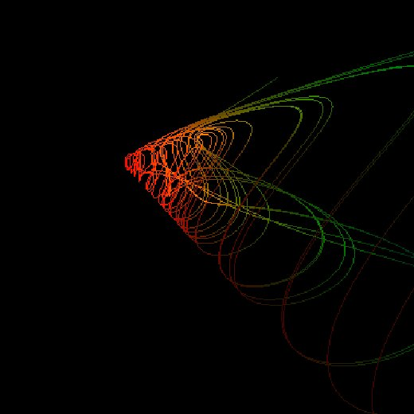 | 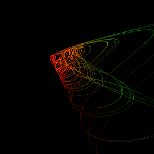 | 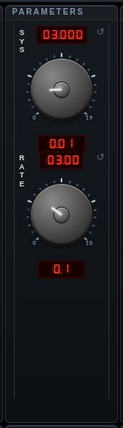 |

Sprott Morph — The faithful version of the glensstuff.com Self-Programming Analog Computer, which stepped itself through the Sprott catalog by re-patching. Every Sprott A–S system is a quadratic 3-D flow — a point in the same 30-dimensional coefficient space Sprott's 1994 computer search ran in — so the machine morphs by sliding linearly between coefficient vectors while ONE trajectory keeps integrating: watch D melt into E. The sys knob parks the patch anywhere in the cycle (fractional = between systems, often chaotic in its own right); the rate knob makes it step itself, in systems per minute; the Console's PATCH readout shows the current wiring. Coefficients are extracted numerically from the catalog's own equations, and a divergence guard reseeds the trajectory when a blend flings it away.

`#sprottmorph` · 3-D flow

#### Sprott A

| Sprott A | turning | parameters |
| --- | --- | --- |
| 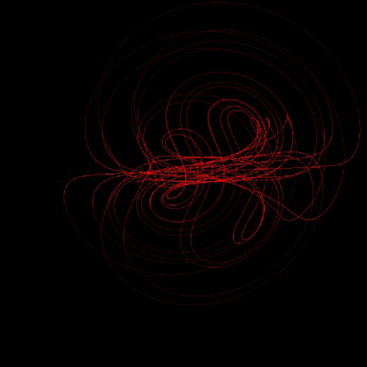 | 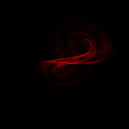 |  |

Sprott A (Nosé–Hoover oscillator) — the first of J. C. Sprott's 1994 systems and the only conservative one: rather than settling onto a strange attractor it fills a chaotic sea.

```
dx/dt = y
dy/dt = −x + yz
dz/dt = 1 − y²
```

`#sprotta` · 3-D flow

#### Sprott B

| Sprott B | turning | parameters |
| --- | --- | --- |
| 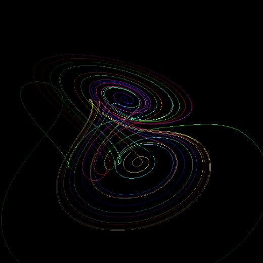 | 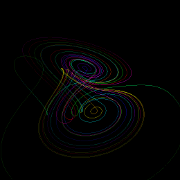 |  |

Sprott B — one of J. C. Sprott's simple chaotic flows (1994), realized as an analog circuit at glensstuff.com. Found by systematic search for the algebraically simplest systems that still produce chaos.

```
dx/dt = yz
dy/dt = x − y
dz/dt = 1 − xy
```

`#sprottb` · 3-D flow

#### Sprott C

| Sprott C | turning | parameters |
| --- | --- | --- |
| 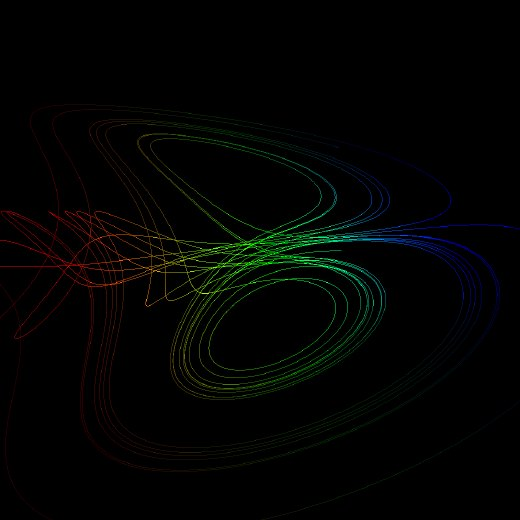 | 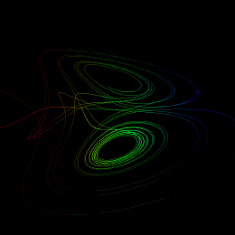 |  |

Sprott C — one of J. C. Sprott's simple chaotic flows (1994), realized as an analog circuit at glensstuff.com. Found by systematic search for the algebraically simplest systems that still produce chaos.

```
dx/dt = yz
dy/dt = x − y
dz/dt = 1 − x²
```

`#sprottc` · 3-D flow

#### Sprott D

| Sprott D | turning | parameters |
| --- | --- | --- |
| 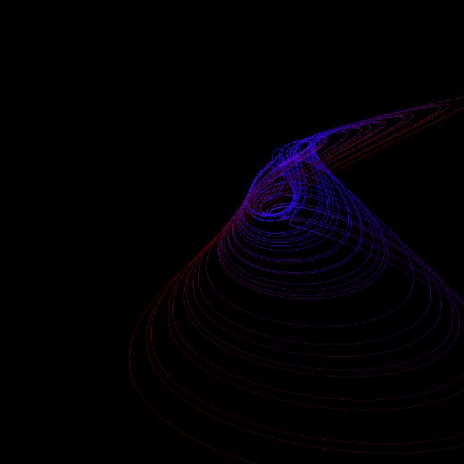 |  |  |

Sprott D — one of J. C. Sprott's simple chaotic flows (1994), realized as an analog circuit at glensstuff.com. Found by systematic search for the algebraically simplest systems that still produce chaos.

```
dx/dt = −y
dy/dt = x + z
dz/dt = xz + 3y²
```

`#sprottd` · 3-D flow

#### Sprott E

| Sprott E | turning | parameters |
| --- | --- | --- |
|  |  |  |

Sprott E — one of J. C. Sprott's simple chaotic flows (1994), realized as an analog circuit at glensstuff.com. Found by systematic search for the algebraically simplest systems that still produce chaos.

```
dx/dt = yz
dy/dt = x² − y
dz/dt = 1 − 4x
```

`#sprotte` · 3-D flow

#### Sprott F

| Sprott F | turning | parameters |
| --- | --- | --- |
|  |  |  |

Sprott F — one of J. C. Sprott's simple chaotic flows (1994), realized as an analog circuit at glensstuff.com. Found by systematic search for the algebraically simplest systems that still produce chaos.

```
dx/dt = y + z
dy/dt = −x + 0.5y
dz/dt = x² − z
```

`#sprottf` · 3-D flow

#### Sprott G

| Sprott G | turning | parameters |
| --- | --- | --- |
|  |  |  |

Sprott G — one of J. C. Sprott's simple chaotic flows (1994), realized as an analog circuit at glensstuff.com. Found by systematic search for the algebraically simplest systems that still produce chaos.

```
dx/dt = 0.4x + z
dy/dt = xz − y
dz/dt = −x + y
```

`#sprottg` · 3-D flow

#### Sprott H

| Sprott H | turning | parameters |
| --- | --- | --- |
|  |  |  |

Sprott H — one of J. C. Sprott's simple chaotic flows (1994), realized as an analog circuit at glensstuff.com. Found by systematic search for the algebraically simplest systems that still produce chaos.

```
dx/dt = −y + z²
dy/dt = x + 0.5y
dz/dt = x − z
```

`#sprotth` · 3-D flow

#### Sprott I

| Sprott I | turning | parameters |
| --- | --- | --- |
|  |  |  |

Sprott I — one of J. C. Sprott's simple chaotic flows (1994), realized as an analog circuit at glensstuff.com. Found by systematic search for the algebraically simplest systems that still produce chaos.

```
dx/dt = −0.2y
dy/dt = x + z
dz/dt = x + y² − z
```

`#sprotti` · 3-D flow

#### Sprott J

| Sprott J | turning | parameters |
| --- | --- | --- |
|  |  |  |

Sprott J — one of J. C. Sprott's simple chaotic flows (1994), realized as an analog circuit at glensstuff.com. Found by systematic search for the algebraically simplest systems that still produce chaos.

```
dx/dt = 2z
dy/dt = −2y + z
dz/dt = −x + y + y²
```

`#sprottj` · 3-D flow

#### Sprott K

| Sprott K | turning | parameters |
| --- | --- | --- |
|  |  |  |

Sprott K — one of J. C. Sprott's simple chaotic flows (1994), realized as an analog circuit at glensstuff.com. Found by systematic search for the algebraically simplest systems that still produce chaos.

```
dx/dt = xy − z
dy/dt = x − y
dz/dt = x + 0.3z
```

`#sprottk` · 3-D flow

#### Sprott L

| Sprott L | turning | parameters |
| --- | --- | --- |
|  |  |  |

Sprott L — one of J. C. Sprott's simple chaotic flows (1994), realized as an analog circuit at glensstuff.com. Found by systematic search for the algebraically simplest systems that still produce chaos.

```
dx/dt = y + 3.9z
dy/dt = 0.9x² − y
dz/dt = 1 − x
```

`#sprottl` · 3-D flow

#### Sprott M

| Sprott M | turning | parameters |
| --- | --- | --- |
|  |  |  |

Sprott M — one of J. C. Sprott's simple chaotic flows (1994), realized as an analog circuit at glensstuff.com. Found by systematic search for the algebraically simplest systems that still produce chaos.

```
dx/dt = −z
dy/dt = −x² − y
dz/dt = 1.7 + 1.7x + y
```

`#sprottm` · 3-D flow

#### Sprott N

| Sprott N | turning | parameters |
| --- | --- | --- |
|  |  |  |

Sprott N — one of J. C. Sprott's simple chaotic flows (1994), realized as an analog circuit at glensstuff.com. Found by systematic search for the algebraically simplest systems that still produce chaos.

```
dx/dt = −2y
dy/dt = x + z²
dz/dt = 1 + y − 2z
```

`#sprottn` · 3-D flow

#### Sprott O

| Sprott O | turning | parameters |
| --- | --- | --- |
|  |  |  |

Sprott O — one of J. C. Sprott's simple chaotic flows (1994), realized as an analog circuit at glensstuff.com. Found by systematic search for the algebraically simplest systems that still produce chaos.

```
dx/dt = y
dy/dt = x − z
dz/dt = x + xz + 2.7y
```

`#sprotto` · 3-D flow

#### Sprott P

| Sprott P | turning | parameters |
| --- | --- | --- |
|  |  |  |

Sprott P — one of J. C. Sprott's simple chaotic flows (1994), realized as an analog circuit at glensstuff.com. Found by systematic search for the algebraically simplest systems that still produce chaos.

```
dx/dt = 2.7y + z
dy/dt = −x + y²
dz/dt = x + y
```

`#sprottp` · 3-D flow

#### Sprott Q

| Sprott Q | turning | parameters |
| --- | --- | --- |
|  |  |  |

Sprott Q — one of J. C. Sprott's simple chaotic flows (1994), realized as an analog circuit at glensstuff.com. Found by systematic search for the algebraically simplest systems that still produce chaos.

```
dx/dt = −z
dy/dt = x − y
dz/dt = 3.1x + y² + 0.5z
```

`#sprottq` · 3-D flow

#### Sprott R

| Sprott R | turning | parameters |
| --- | --- | --- |
|  |  |  |

Sprott R — one of J. C. Sprott's simple chaotic flows (1994), realized as an analog circuit at glensstuff.com. Found by systematic search for the algebraically simplest systems that still produce chaos.

```
dx/dt = 0.9 − y
dy/dt = 0.4 + z
dz/dt = xy − z
```

`#sprottr` · 3-D flow

#### Sprott S

| Sprott S | turning | parameters |
| --- | --- | --- |
|  |  |  |

Sprott S — one of J. C. Sprott's simple chaotic flows (1994), realized as an analog circuit at glensstuff.com. Found by systematic search for the algebraically simplest systems that still produce chaos.

```
dx/dt = −x − 4y
dy/dt = x + z²
dz/dt = 1 + x
```

`#sprotts` · 3-D flow

### Maps

[Henon](#henon) · [Ikeda](#ikeda) · [Clifford](#clifford) · [Peter de Jong](#peter-de-jong) · [Gumowski-Mira](#gumowski-mira) · [Tinkerbell](#tinkerbell) · [Chirikov Standard Map](#chirikov-standard-map)

#### Henon

| Henon | turning | parameters |
| --- | --- | --- |
|  |  |  |

Hénon map (M. Hénon, "A two-dimensional mapping with a strange attractor", 1976) — the example that showed a strange attractor needs neither a flow nor three dimensions, only a stretch and a fold. Zoom in anywhere on a filament and it resolves into more filaments: locally a line crossed with a Cantor set. Its Jacobian determinant is −b, so area contracts by exactly b every iterate no matter where you are.

```
x' = 1 − a·x² + y
y' = b·x
```

`#henon` · discrete map

#### Ikeda

| Ikeda | turning | parameters |
| --- | --- | --- |
|  |  |  |

Ikeda map (K. Ikeda, 1979) — light circulating in a nonlinear optical cavity, where each pass rotates the complex field by an amount that depends on its own intensity. That intensity-dependent rotation is the whole mechanism: the more energetic part of the beam turns further, and the attractor's hook is the result.

```
t = 0.4 − 6/(1 + x² + y²)
x' = 1 + u·(x·cos t − y·sin t)
y' = u·(x·sin t + y·cos t)
```

`#ikeda` · discrete map

#### Clifford

| Clifford | turning | parameters |
| --- | --- | --- |
|  |  |  |

Clifford attractor (Clifford Pickover) — a trigonometric map with no physical derivation, kept because of what it draws. Every parameter change reshapes it entirely, which makes the four knobs worth turning slowly.

```
x' = sin(a·y) + c·cos(a·x)
y' = sin(b·x) + d·cos(b·y)
```

`#clifford` · discrete map

#### Peter de Jong

| Peter de Jong | turning | parameters |
| --- | --- | --- |
|  |  |  |

Peter de Jong attractor — the same idea as Clifford's with the terms paired differently, and a different family of figures for it. Four knobs, an enormous space of shapes, and no way to predict which you will get.

```
x' = sin(a·y) − cos(b·x)
y' = sin(c·x) − cos(d·y)
```

`#dejong` · discrete map

#### Gumowski-Mira

| Gumowski-Mira | turning | parameters |
| --- | --- | --- |
|  |  |  |

Gumowski-Mira map (I. Gumowski and C. Mira, CERN, 1980) — written to study how a particle beam drifts turn after turn around an accelerator ring, and it produces organic, almost biological figures that look nothing like their origin. The shared nonlinearity g is applied twice per iterate, to x and then to the NEW x. Unlike the others here it is QUASI-PERIODIC at these settings rather than chaotic: the curves it draws are invariant curves the orbit winds around forever, not a fractal dust. Two orbits started a hair apart drift apart slowly instead of separating exponentially, which is why the figure looks woven rather than sprayed.

```
g(v) = μ·v + 2(1−μ)·v²/(1+v²)
x' = y + a(1 − b·y²)·y + g(x)
y' = −x + g(x')
```

`#mira` · discrete map

#### Tinkerbell

| Tinkerbell | turning | parameters |
| --- | --- | --- |
|  |  |  |

Tinkerbell map — a quadratic map of the plane whose orbit sweeps a curved, wing-like region. Bounded only for a narrow band of parameters; push the knobs and it escapes to infinity, which the renderer catches and reseeds rather than drawing NaNs.

```
x' = x² − y² + a·x + b·y
y' = 2·x·y + c·x + d·y
```

`#tinkerbell` · discrete map

#### Chirikov Standard Map

| Chirikov Standard Map | turning | parameters |
| --- | --- | --- |
|  |  |  |

Chirikov standard map (B. Chirikov, 1979) — the canonical AREA-PRESERVING map, and the one system here with no attractor at all. A kicked rotor: each iterate kicks the momentum by K·sin θ and lets the angle advance. Because area is preserved nothing contracts onto anything, so it is drawn as an ensemble of orbits rather than one — a single orbit would trace its own invariant curve and tell you nothing about the rest. Turn K up and watch the intact curves break into a chaotic sea with islands of stability stranded in it; near K ≈ 0.9716 the last curve spanning the phase space goes, and orbits can wander in momentum without bound.

```
p' = p + K·sin θ
θ' = θ + p'   (both mod 2π)
```

`#standardmap` · discrete map

### Scope

[Lissajous](#lissajous) · [Graphic Artist](#graphic-artist) · [Scope Pong](#scope-pong) · [Fourier Text](#fourier-text) · [Scope Clock](#scope-clock) · [Bouncing Ball](#bouncing-ball) · [XY Scope](#xy-scope) · [Takens Embedding](#takens-embedding) · [Stereo Embedding](#stereo-embedding)

#### Lissajous

| Lissajous | turning | parameters |
| --- | --- | --- |
|  |  |  |

Lissajous Curve — Named after Jules Antoine Lissajous (1822–1880), these are parametric curves formed by combining sinusoidal motions along each axis. Not a chaotic system — the curves are periodic and their shape depends on the frequency ratios and phase relationships between the three oscillations.

```
x(t) = sin(at)
y(t) = sin(bt)
z(t) = sin(ct)
```

`#lissajou` · parametric

#### Graphic Artist

| Graphic Artist | turning | parameters |
| --- | --- | --- |
|  |  |  |

Graphic Artist — a digital re-creation of Mitchell Waite's "Oscilloscope Graphic Artist" (Popular Electronics, November 1975), which drove a scope's X/Y inputs with harmonically related signals to draw 3-D-looking wireframes. Four relaxation oscillators A/B/C/D, each square or triangle: A is the fixed master and B/C/D lock to it at integer harmonics — the sync the original circuit was meant to enforce, and which a wiring error on real builds defeated, leaving them drawing an unstable blur. Carrier C is split ±45° and the B envelope modulates each phase; the two perpendicular components are what create the volume illusion on a flat scope, and here that component is lifted onto a real Z so the figure genuinely has depth.

```
VERT = levelA·A + levelB·(B · C₊₄₅)
HORIZ = levelD·D + levelB·(B · C₋₄₅)
```

`#graphicartist` · parametric

#### Scope Pong

| Scope Pong | turning | parameters |
| --- | --- | --- |
|  |  |  |

Scope Pong — An homage to the glensstuff.com analog Oscilloscope Pong: the whole game is one multiplexed beam tour driving the X/Y inputs, so the court, net, score ticks, paddles and ball share a single stroke — the faint diagonal beams are the retrace an unblanked scope really shows.

W / S move the left paddle, ↑ / ↓ the right; a side left alone for ~10 s returns to the machine player (it boots as a self-playing demo). First to 9 resets the match. Knobs: ball speed, paddle size, machine skill.

`#pong` · parametric

#### Fourier Text

| Fourier Text | turning | parameters |
| --- | --- | --- |
|  |  |  |

Fourier Text — An homage to the glensstuff.com Fourier Synthesis Character Generator, which built alphanumerics on a scope from summed harmonics. The banner's whole beam tour (strokes and retrace jumps alike) is one complex periodic signal x(t)+i·y(t); what's drawn is its reconstruction from only the first N harmonics — real harmonic synthesis, not a blur. One harmonic is an ellipse, so at low N the letters melt into loops; raise the harm knob and overtones sharpen them into legibility. Type the banner in the Console's TEXT field; Model Out (CAM) plays the actual harmonic stack.

`#scopetext` · parametric

#### Scope Clock

Scope Clock — the time, drawn the way a scope draws anything: as ONE beam tour. The face, the twelve ticks and the three hands are a single path walked in order, because an X/Y display has one beam and no way to lift it — so the jumps between the end of one stroke and the start of the next are drawn too, and show as the faint diagonals an unblanked scope really shows. Scope Pong and the Fourier banner are built the same way; this is the same instrument told the time.

The beam is spaced evenly along the whole path rather than given a fixed number of points per stroke: the face is a full circle and a tick is a few hundredths of one, so per-stroke spacing would put most of the beam on the ticks and leave the circle dotted. Even spacing is also what a real scope does, since the beam moves at a rate rather than at a number of samples.

The hands are fractional throughout — the hour hand creeps with the minutes, the minute hand with the seconds — because a clock whose hands jump looks stopped in between. TRAIL and Persist apply as they do to any trace, so a long trail smears the second hand into a comet.

`#scopeclock` · parametric

#### Bouncing Ball

| Bouncing Ball | turning | parameters |
| --- | --- | --- |
|  |  |  |

Bouncing Ball — The classic analog-computer demo (Telefunken shipped it to sell integrators): two integrator chains under constant gravity, a comparator that flips the vertical velocity at the floor with a restitution loss, and wall reflections for the drift. The scope draws the familiar train of shrinking parabolic arcs; when the bounces decay away the machine re-kicks the ball, as the unattended trade-show loop did. Floor hits blip at a pitch set by impact speed (once audio is unlocked by any interaction). Knobs: gravity, restitution, drift. Try Persist to paint the full arc family.

```
y'' = −g, bounce: v ← −e·v at the floor
```

`#bounceball` · parametric

#### XY Scope

| XY Scope | turning |
| --- | --- |
|  |  |

X/Y Scope — the classic two-channel oscilloscope figure, drawing the live audio's (left, right) sample pairs as a line strip. Correlated channels lie on a diagonal, anti-correlated on the other, and a phase difference opens the diagonal into an ellipse — which is how the display doubles as a stereo phase meter. A mono source is plotted against a lagged copy of itself, since a raw mono signal would otherwise be a featureless diagonal.

`#xy` · audio

#### Takens Embedding

| Takens Embedding | turning | parameters |
| --- | --- | --- |
|  |  |  |

Takens Delay Embedding — attractor reconstruction from a single signal (F. Takens, "Detecting strange attractors in turbulence", 1981). Each trail point is the delay vector (s(t), s(t−τ), s(t−2τ)) of the live audio: a pure tone draws a closed loop, music and speech trace the geometry of whatever produced them. τ is the embedding delay in samples, and MEAS measures it rather than guessing: the first minimum of the signal's average mutual information (Fraser & Swinney 1986), reported beside the false-nearest-neighbor embedding dimension m (Kennel et al. 1992). It runs once, on the button — nothing here re-tunes itself per frame, because a knob that moves with the music makes the figure move with it. An m above 3 means the trail you are looking at is a projection of a higher-dimensional reconstruction. WIN is how much time the figure spans, in milliseconds — short is live and legible, long draws a denser tangle that turns over more slowly; GAIN sets how large a full-scale sample draws. The scale is fixed — nothing auto-ranges, so quiet passages draw small and loud ones large, and the view never moves under you; the camera is fitted once to what full scale can reach, so peaks stay on screen. The trace is spline-smoothed between samples the way a scope's beam is. Audio comes from the active source — websocket stream, microphone, or the signal generators.

`#takens` · parametric

#### Stereo Embedding

Stereo Embedding — the Takens trail built from the two channels instead of one channel's past. Takens' theorem manufactures the missing axes out of a signal's own history because there is only one signal; a stereo source has already measured two, so this mode plots them against each other and what you see is the real relationship between the channels — phase, polarity, correlation, width — rather than a reconstruction. Looked at head-on it is the goniometer (vectorscope) of a mastering desk, which is the XY Scope's figure; the third axis is what a scope with two deflection plates cannot give you. AXES picks the assignment. L,R,L(t−τ) is the goniometer with a delay coordinate for depth: a tone that draws one ellipse edge-on unrolls into a helix, and τ still means what it means in the Takens mode. L,R,time sweeps the figure along a ribbon so successive cycles stack instead of overwriting — the only way to see a slow phase drift, which on a flat display just wobbles. The mid/side positions rotate the basis 45°: M=(L+R)/2 and S=(L−R)/2, so center content lies along one axis and difference content along the other and width is an extent rather than a tilt. τ is inert on the two time positions. CORR is the correlation meter: +1.00 means the channels are identical and the figure is a diagonal line, 0 means they are unrelated and it is a round cloud, −1.00 means one is the other inverted (and the difference vanishes if the mix is summed to mono). A mono source reads "mono" and draws the diagonal, which is the correct picture of a signal with no stereo information in it — nothing here fakes a second channel out of a delayed copy of the first, because that delayed copy is exactly what this mode exists to stop pretending is a channel. The mid/side positions are the ones worth turning to then: S is zero and what is left is an honest two-coordinate delay embedding. WIN is how much time the figure spans, in milliseconds — a phase display is read over a few tens of them, past a couple of hundred it is a filled blob; GAIN sets how large a full-scale sample draws, and as in the Takens mode the scale is fixed and nothing auto-ranges. Audio comes from the active source — microphone or the signal generators for real stereo; the websocket and WebTransport feeds carry one channel, so they read "mono".

`#stereo` · parametric

### Polyhedra

[Tetrahedron](#tetrahedron) · [Cube](#cube) · [Octahedron](#octahedron) · [Dodecahedron](#dodecahedron) · [Icosahedron](#icosahedron) · [Nested Cube](#nested-cube)

#### Tetrahedron

| Tetrahedron | turning |
| --- | --- |
|  |  |

Tetrahedron — The simplest Platonic solid, with 4 triangular faces, 6 edges, and 4 vertices. It is its own dual.

`#tetrahedron` · geometry

#### Cube

| Cube | turning |
| --- | --- |
|  |  |

Cube (Hexahedron) — A Platonic solid with 6 square faces, 12 edges, and 8 vertices. Its dual is the octahedron.

`#cube` · geometry

#### Octahedron

| Octahedron | turning |
| --- | --- |
|  |  |

Octahedron — A Platonic solid with 8 triangular faces, 12 edges, and 6 vertices. Its dual is the cube.

`#octahedron` · geometry

#### Dodecahedron

| Dodecahedron | turning |
| --- | --- |
|  |  |

Dodecahedron — A Platonic solid with 12 pentagonal faces, 30 edges, and 20 vertices. Its dual is the icosahedron.

`#dodecahedron` · geometry

#### Icosahedron

| Icosahedron | turning |
| --- | --- |
|  |  |

Icosahedron — A Platonic solid with 20 triangular faces, 30 edges, and 12 vertices. Its dual is the dodecahedron.

`#icosahedron` · geometry

#### Nested Cube

| Nested Cube | turning |
| --- | --- |
|  |  |

Nested Cube — A cube within a cube, connected at the vertices, illustrating the relationship between inner and outer geometric structures.

`#nestedcube` · geometry

### Geometry

[Globe](#globe) · [Sphere](#sphere) · [Torus](#torus) · [Magnetosphere](#magnetosphere)

#### Globe

| Globe | turning | parameters |
| --- | --- | --- |
|  |  |  |

Globe — A wireframe sphere showing lines of latitude and longitude, similar to the graticule on a geographic globe. Latitude lines are horizontal circles parallel to the equator, longitude lines are great circles passing through the poles.

`#globe` · geometry

#### Sphere

| Sphere | turning | parameters |
| --- | --- | --- |
|  |  |  |

Sphere — A perfectly round three-dimensional surface where every point is equidistant from the center. Generated as a UV sphere with configurable latitude and longitude subdivisions.

`#sphere` · geometry

#### Torus

| Torus | turning | parameters |
| --- | --- | --- |
|  |  |  |

Torus — A doughnut-shaped surface of revolution generated by revolving a circle (radius r) around an axis at distance R from the center of the circle.

`#torus` · geometry

#### Magnetosphere

| Magnetosphere | turning |
| --- | --- |
|  |  |

Magnetosphere — A visualization of magnetic field lines surrounding a dipole, similar to Earth's magnetosphere that shields the planet from solar wind.

`#magnetosphere` · geometry

### Sequences

[Turtle Path](#turtle-path)

#### Turtle Path

| Turtle Path | turning | in 2-D (mod 30, closed) | parameters |
| --- | --- | --- | --- |
|  |  |  |  |

Turtle Path — Reduce an integer sequence modulo m and the remainders repeat; the length of the repeat is the Pisano period. Read each term as an instruction — odd turns left and steps forward, even turns right and steps forward, zero does neither — and the walk draws a figure. In three dimensions the parity of the NEXT term decides whether the turn is a yaw or a pitch, which is not arbitrary: the pair (F_n, F_n+1) mod m is the state of the recurrence, and the Pisano period is the period of that pair. One pass decides the rest, without walking further: the figure either closes, drifts in a straight line, or screws away along an axis. The walk never finishes and is never restarted — the turtle is held mid-stride and extended at the Speed knob's rate, forever, and TRAIL is how much stays behind it (whole, long, short, comet) as the oldest scrolls off the far end. CAM is where it is watched from. Only follow cares where the head is; every other setting places the figure by its DRIFT, the one direction it is going overall, known exactly from one pass of the period rather than guessed at from the last few frames — and for a screw it centers on the axis the classification locates, so the figure turns on the spot instead of swinging around it. fit then only decides how big it is drawn, lock holds that size too, and auto fits a closed figure and locks one that drifts. TINT is what a color means — step, pass, visits, heading, turn, term, age — and set COLORS SRC to trl to see it, or leave it on X/Y/Z to read position instead (a flat DIM 2 figure has no Z to follow). MUL multiplies the Fibonacci sequence, CAP limits the terms read for sequences that may not repeat, CYCLE steps to the next modulus every so many seconds, and MOD 0 draws the sequence unreduced. PHYS gives the figure weight: it becomes a rigid body in the plane of the screen — three degrees of freedom, the figure's own shape as its mass — inside a solid box the size of the frame, where GRAV (either way up), FRIC, BOUNCE and SPIN say how it behaves. Press on the figure and you can pick it up and throw it; press beside it and you are turning the view as usual. The walk keeps extruding while it lies there, new points arriving at the head and old ones dropping off the tail, so the figure slides through its own body and marches. PHYS off hands the placing back to CAM.

`#turtle` · parametric

### Solids

[STL File](#stl-file) · [Terminal](#terminal) · [Terminal Animation](#terminal-animation) · [Host Shell](#host-shell) · [Desk](#desk)

#### STL File

| STL File | turning |
| --- | --- |
|  |  |

STL File — Load a stereolithograph (.stl, binary or ASCII) from disk with the Loader module's Load button and it renders as a rotating wireframe. Very large files are decimated to fit the 16-bit index pipeline.

`#stlfile` · geometry

#### Terminal

Terminal — a live terminal, drawn as a model. It is the same texture-on-a-plane path the spectrogram and the recurrence plot use, so it rotates, zooms and takes a gradient like any other model; what is on the texture is [xterm-go](https://github.com/0magnet/xterm-go), a Go port of xterm.js, rendering a real terminal grid with WebGL2. That last part is what makes this possible rather than merely desirable: a terminal drawn as DOM could not be sampled into a texture at all, and rasterizing DOM every frame is not a thing worth doing. xterm-go renders into a canvas, and a canvas is a texture source. Behind it runs [websh](https://github.com/0magnet/websh), a Bash interpreter compiled to wasm over an in-memory filesystem, so this is a session you can work in and not a picture of one: pipes, globs, redirection, `for` loops, all of it rotating with the model. **Double-click** the canvas to type into it and **Esc** to give the keyboard back — a double click because a single one is how you rotate the model, and the two must not be the same gesture. Focusing it silences the app's own key bindings automatically, since Pong, the Keys module and the hovered-knob arrows all already stand aside for a focused textarea, which is what a terminal captures keys on. It can also be the BACKDROP behind another model, the way the spectrogram can.

`#terminal` · geometry

#### Terminal Animation

Terminal Animation — the same terminal-on-a-plane, with a drawing program on it instead of a shell. The catalog is [tuiwasm](https://github.com/0magnet/tuiwasm): twenty-one animations — fire, plasma, a matrix rain, an aquarium, a bonsai growing branch by branch, Langton's ant, falling sand — plus charts, tables and styled text. Pick one from the **animation** selector on this model's panel. The animations draw at half-block resolution: every cell is an upper or lower block glyph carrying its own foreground and background, which is two independently colored pixels per cell and roughly square ones, since a terminal cell is about twice as tall as it is wide. They run at the frame rate — the cells are written straight into xterm-go's buffer rather than encoded as escape sequences and parsed back, which is the difference between sixty frames a second and a wedged tab. Nothing is wired to the keyboard here, unlike the Terminal model: these draw, they do not read, and the animations quit on a keystroke. Like the terminal it can also be the BACKDROP behind another model.

`#termanim` · geometry

#### Host Shell

Host Shell — a real shell on the machine serving this page, drawn as a model. The Terminal model beside it is [websh](https://github.com/0magnet/websh), a Bash interpreter compiled into the wasm over a filesystem that exists only in the browser; this one is a pty on the host, reached through the same agent the desk's host pane uses. It needs the server to have been started with **--shell**, which also forces a loopback bind — the server refuses that flag on a listener the network can reach rather than warning about it. Without the flag the terminal still opens and says so, because an empty rectangle with no explanation is the worse answer. **Double-click** the canvas to type into it and **Esc** to give the keyboard back, exactly as for the Terminal model. It reached the screen before this as a window inside the Desk; as a model it is the shell without the window manager around it.

`#hostterm` · geometry

#### Desk

Desk — a window manager, drawn as a model. The same texture-on-a-plane path the spectrogram, the recurrence plot and the Terminal use, with a whole [desk](https://github.com/0magnet/desk) on it: winbox windows, a [websh](https://github.com/0magnet/websh) shell in each, a file manager, all of them running while you rotate them. It needed something from desk to be possible at all. A window is more than its pane — its title, buttons and border are DOM, and DOM cannot be sampled into a texture — so texturing the panes alone would give a desk of frameless rectangles. desk's WebGL compositor can now REDRAW the frames instead: each title bar is rasterized with Canvas2D, text and buttons and all, into the same canvas it draws the panes into, and that canvas is a complete picture of the desk. Nothing types into it while it is a model, and that is the arrangement rather than an omission for the MOUSE: a click on a rotated quad would have to be cast through it to a texture coordinate and synthesized back into a DOM event at a place nothing is. What you get instead are two gestures. **Ctrl-drag** reaches the desk, so ctrl-dragging a title bar moves a window while an ordinary drag still turns the model; the **Pass-thru** switch in the Desk module swaps the two if you would rather drag windows directly and hold ctrl to turn. And the KEYBOARD does reach it: **double-click** the canvas to type into the focused window and **Esc** to give the keyboard back, the same pair the Terminal and Host Shell models use. Aiming is the honest limitation — you are pointing at a projection, so a title bar is not where the pointer says it is. The **Desk** switch (Console → Window) puts the same windows on the page as ordinary DOM, which is the one to use for arranging them; rearrange there, then come back here to look at it. Flatten to work, rotate to admire. It can also be the BACKDROP behind another model, the way the spectrogram and the terminal can.

`#desk` · geometry

### Audio

[Spectrogram](#spectrogram) · [XY Scope](#xy-scope) · [FVF Wobbulator](#fvf-wobbulator) · [Takens Embedding](#takens-embedding) · [Stereo Embedding](#stereo-embedding) · [Recurrence Plot](#recurrence-plot)

#### Spectrogram

| Spectrogram | turning | parameters |
| --- | --- | --- |
|  |  |  |

Spectrogram — a scrolling short-time Fourier transform of the live audio: frequency up the plane, time scrolling right to left, magnitude as color. It is a display inspired by Vanya Sergeev's audioprism, written in Go (github.com/0magnet/audioprism-go) and drawn here as a texture on a plane in the same 3-D pipeline as every other model, so it rotates and zooms like one — and the same texture can be painted onto other geometry with the skin switch. The Spectrogram module exposes the whole chain: transform size, overlap, window function, magnitude scale and limits, and color scheme.

`#spectrogram` · audio

#### XY Scope

See [XY Scope](#xy-scope) above.

#### FVF Wobbulator

| FVF Wobbulator | turning | parameters |
| --- | --- | --- |
|  |  |  |

FVF — Harmonic Wobbulator. A software analog of the Frequency→Voltage→Frequency converter with balanced modulator designed at bunkerofdoom.com (hardware built 1984). The live audio's pitch is tracked, scaled/offset into a new carrier frequency, and ring- or AM-modulated back by the original signal — the metallic, glitchy 'very strange' timbre. Shown here as the processed spectrogram.

`#fvf` · audio

#### Takens Embedding

See [Takens Embedding](#takens-embedding) above.

#### Stereo Embedding

See [Stereo Embedding](#stereo-embedding) above.

#### Recurrence Plot

| Recurrence Plot | turning | parameters |
| --- | --- | --- |
|  |  |  |

Recurrence Plot — the picture of when a signal returns to where it has already been (J.-P. Eckmann, S. O. Kamphorst and D. Ruelle, "Recurrence Plots of Dynamical Systems", 1987). Time runs along both axes, and the cell (i, j) is lit when the two samples are within ε of each other, so the main diagonal is always lit and everything else says how the signal repeats. A steady tone draws unbroken diagonals spaced by its period; a chaotic or noisy source breaks them into short segments; a held sound is a solid block, and the instant the source changes is an edge running across the square. WIN is how much history the square covers and ε is the threshold, as a fraction of full scale — a fixed one, deliberately, since a threshold taken from the current level would make the plot's density pulse with the music instead of describing it. Drawn as a texture on a square plane in the same 3-D pipeline as every other model. The companion measurement lives in the Takens mode, whose MEAS button estimates the embedding delay and dimension of the same signal.

`#recurrence` · audio

### Analysis

[Bifurcation](#bifurcation) · [Recurrence Plot](#recurrence-plot)

#### Bifurcation

| Bifurcation | turning |
| --- | --- |
|  |  |

Bifurcation Explorer — the fig-tree diagram, computed live. One parameter of the most recent flow mode sweeps its whole knob range across the x axis; each column integrates the system fresh at that value and plots the local maxima of z. Thin branches are periodic orbits, fan-outs are period-doubling cascades, filled bands are chaos — the route between them is the route to chaos. Pick the swept parameter in the Parameters module; visit an attractor and tune it to change the source system.

`#bifurcation` · parametric

#### Recurrence Plot

See [Recurrence Plot](#recurrence-plot) above.

### Custom

[Custom equation](#custom-equation)

#### Custom equation

| Custom equation | turning | parameters |
| --- | --- | --- |
|  |  |  |

Custom Equations — type your own system. The Equations module takes dx/dt, dy/dt and dz/dt (plus dw/dt for a 4-D system) as text and integrates them with forward Euler, the same way the classic attractors are stepped. The iterate switch reads the same expressions as a discrete MAP instead — x = f(x,y,z) rather than x += dt·f(x,y,z) — which has no dt and no path between iterates, so it draws as a cloud of points the way Henon and Ikeda do. There is no eval: expressions are tokenized, converted to RPN and interpreted over a small value stack, so nothing but arithmetic can run. Grammar is + − × ÷ ^ with grouping and implicit multiplication (2x, 3(x+1)), the functions sin cos tan asin acos atan exp log ln sqrt abs sign sinh cosh tanh floor, the constants pi e tau, and the variables x y z w t. Any other name becomes a free parameter and is auto-exposed as its own knob.

`#custom` · 4-D flow

<!-- END MODELS -->

## Reaching the machine

Off by default, and worth being. A browser tab that can run commands as you is
the most valuable target on the machine, and any page you visit may try to
reach localhost.

```
chaosrack --shell                      # a real pty, in a desk window
chaosrack --fs                         # real files, for the shell and the file manager
chaosrack --fs --fs-root ~/projects    # ...confined to a subtree
chaosrack -b 127.0.0.1 -p 8080         # --bind, if the default is not what you want
```

- Nothing is served unless `--shell` or `--fs` is passed.
- Either flag **changes the default bind to loopback**. Every interface stays
  the default otherwise, because serving the visualizer on a LAN is reasonable;
  an explicit `--bind` is still obeyed, and then **refused** if it is not
  loopback. A default that quietly overrode what you typed would be worse than
  a refusal that says why.
- The `Origin` must match a page this listener served, and ordinary requests
  are checked with `Sec-Fetch-Site` as well — a browser does **not** send
  `Origin` on a same-origin GET, so requiring one would refuse exactly the
  traffic the check exists to permit.
- A token from `crypto/rand`, per run, never written to disk — put in the
  served page by default, or printed to your terminal instead with `--auth`.
- `--fs-root` confines paths for real: they are resolved through
  `EvalSymlinks` on the longest *existing* prefix, so a symlink planted inside
  the root cannot be followed out of it.

### On a machine with other people on it

Add `--auth`. The default injects the token into the served page, which is
frictionless and right when the only person who can read that page is you — and
wrong on a shared box, for a precise reason: **the Origin check does not stop a
local process.** It stops a hostile web *page*, because a browser sets `Origin`
itself and script cannot change it, but anything that is not a browser sends
whatever header it likes. So another user can fetch the page, read the token,
forge an `Origin`, and have a shell as you.

```
chaosrack --shell --auth
```

The token is printed to the terminal that started the server and left out of
the page. Opening the **host shell** window then asks for it, in the terminal
itself, and remembers it for the rest of the tab; a wrong one is refused and it
asks again. There is deliberately no `--password` flag: a password on a command
line is not a secret, since `/proc/<pid>/cmdline` is readable by other users on
exactly the machines where this threat exists.

**Nothing needs a reload.** The `--fs` half used to be composed at startup —
when, under `--auth`, there was nothing to compose it from — so the file manager
and websh stayed on the in-memory filesystem until the page was loaded again,
having just been told the host shell was connected. That reads as the token not
working. The desk's shared filesystem is now a *switch*: every consumer takes an
`afero.Fs` once and keeps it, so the backing is replaced under them the moment
the token is accepted, and the file manager re-renders on the event that
announces it. Verified by typing a token into the host shell and watching a
websh session that started *before* the token existed write a file to the real
`/tmp`. A refused token is withdrawn again and the desk goes back to memory,
because a filesystem answering 403 to everything looks broken rather than
unauthorized.

The Origin check is the load-bearing one and the token is honestly the weaker
guard: a browser sets `Origin` itself and script cannot forge it, whereas a
local process running as you can read the token out of the served page — and
such a process already has your shell without asking this one. Defense in
depth, not a boundary. Stopping the server revokes both.

None of this is a sandbox. With `--shell` the pty is your account, and `--fs`
without `--fs-root` is your whole filesystem — which is the right default only
because `--shell` already implies it, and a fence beside an open gate is not a
fence. The agent itself lives in
[desk](https://github.com/0magnet/desk); this serves it.

## The rack

The control surface is a rack of modules. Each one is a slot-quantized panel
with its own header, and the header is a handle: drag it and the module
settles into whatever gap you drop it in. Every module has a switch in the
Console's **Modules** column — except the Console, which is where the switches
live and so is the one module that cannot be put away.

**Desk** (Console → Window) puts a window manager over the scene:
[desk](https://github.com/0magnet/desk) windows floating above the canvas,
with a [websh](https://github.com/0magnet/websh) shell and a file manager in
them, while the model keeps integrating underneath and stays tunable from every
knob on the rack. There is no second panel — the desk's own launcher is a bar
at the bottom of the page and so is this rack, and two of them would fight for
one edge — so the shell is the launcher: `apps` lists what can be opened,
`open files` and `term` open them.

The empty desktop does **not** swallow the mouse. Pointer events are off on the
desk's root and on again per window, so dragging where there is no window still
rotates what is behind them. The desk also gets a **z-index of its own**, which
makes it a stacking context: winbox numbers its windows from about 10 upward
and this panel sits at 10, so without one a raised window would climb over the
rack.

The selector beside the switch chooses one of **four 3-D desktops**, each a
reproduction of a real one, and each with the gesture that made it what it was:

| | | |
|---|---|---|
| **Flat** | — | ordinary windows |
| **Looking Glass** | Sun, 2003 | windows lean back in a legible stack; **double-click a title bar** to turn one over and read its back, which is what the original was actually for — the tilt everyone remembers was the side effect |
| **Cube** | Compiz, 2006 | four workspaces on the faces of a cube; the **arrow keys** spin it, and faces dim rather than vanish as they turn away |
| **Metisse** | 2004 | **shift-drag a title bar** to turn a window to any angle — and keep typing into it, because a CSS 3-D transform is a real projection and the browser hit-tests what it draws |
| **BumpTop** | 2009 | windows get weight and fall into a pile on top of the rack |

They are reproductions rather than pictures: the windows are real and the
shells in them are running.

The desk can also be drawn *into* the scene, as the **Desk** model (Solids →
Desk) — but only because desk was taught to draw its own chrome. A window is
more than its pane: the title, the buttons and the border are DOM, and DOM
cannot be sampled into a texture, so texturing the panes alone gives a desk of
frameless rectangles. desk's WebGL compositor can now rasterize each title bar
with Canvas2D — text, buttons and all — into the same canvas it draws the panes
into, and chaosrack samples that one canvas. You can work in it while it is a model, which took two goes at deciding it
was impractical before it turned out not to be.

The **keyboard** needs nothing clever: a key goes wherever the DOM focus is
and the windows are still in the DOM, hidden but present, so double-click the
canvas to type into the focused window and `Esc` to give the keyboard back.

The **mouse** is the half with a position, so the position is translated —
screen point to a ray, ray to the quad in model space, quad coordinates to
canvas pixels, and canvas pixels to a page point. That last step is what makes
the rest easy: the compositor's canvas is a 1:1 picture of the desk's own
rectangle, so a canvas pixel *is* a page point, and `elementFromPoint` hands
back the real element for winbox's own code to handle. Verified by clicking
where a window's close button is *drawn*, on a rotated quad, and having the
window close.

**Pass-thru** (Console → Window) chooses which gesture is the cheap one, and
**Ctrl inverts it** — so both are always available:

| | plain drag | Ctrl-drag |
|---|---|---|
| **Pass-thru off** | turn the model | reach the desk |
| **Pass-thru on** | reach the desk | turn the model |

The modifier is dropped from the synthesized event, or a Ctrl-drag would arrive
at a window as a Ctrl-click and open a context menu nobody asked for.

The cube is an honest approximation and not a closed box: windows cannot be
reparented into face elements without breaking dragging, so each is placed on
its face by transform alone about a shared origin, and faces holding windows of
different sizes do not tile.

**Contain** (Console → Window) turns the whole arrangement inside out. The two
above put the desk somewhere inside chaosrack — over the scene, or on a quad.
This puts *chaosrack inside the desk*: the desk's panel takes the bottom of the
screen, and the control panel becomes a **window on that desk**, with a task
button beside the desk's own windows. Minimize it and it goes to the panel;
click the button and it comes back. The background stays black, and the model
keeps running behind all of it.

It needed almost nothing new, which is worth saying because it sounds like a
rewrite. Three things already existed and only had to be pointed at each other:
the panel has been a real [winbox](https://github.com/0magnet/winbox-go) window
in float mode for a long time, with the minimize button every window gets;
desk's panel tracks a `Window` that is a *title, a focus function and a liveness
function* — not a winbox handle, not a desk-launched app — so it will adopt
anything that can say those three things; and the desk is already mounted,
already stacked between the canvas and the rack, and already knows how to keep
out of the mouse's way. So the rack is floated, described to the panel, and that
is the whole of it.

The **▤ button hides the environment**, not just the controls: the panel, the
desk's windows and the rack window all go, and the model is left on screen. The
rack window has to be hidden separately, because winbox mounts on `document.body`
— so the rack is not a *descendant* of the desk's element even while it is a
window *on* the desk. Hiding the desk alone left a bare title bar behind, since
▤ hides the panel's contents and the frame around them is not part of that.

Minimizing it also turned up a real bug one layer down, now fixed in winbox-go.
A window manager parks a minimized window in a slot along the bottom using the
same move-and-resize path a drag takes, so `OnMove` and `OnResize` fire for it —
and `Min` was set *after* the parking, leaving a callback no way to tell being
parked from being placed. Persisting geometry from those callbacks is what they
are for, so the panel saved the 251×35 slot as its remembered size, came back
from the minimize as a bare title bar, and came back that way on every later
load, because the wrong numbers were in `localStorage`. The flag goes up first
now; this end guards on it, and repairs a geometry already poisoned — all four
values, not the failing one, since the parked width landed eleven pixels above
the minimum and the parked *y* is a legal place to put a window and an
impossible place to put a 720-pixel-tall one.

**Rack bay** (Console → Window) draws the 19-inch frame the modules are
actually in: rails above and below the 3U opening, an ear each side with a
grab handle bolted to it, and blank panels filling the end of a row on the
same slot pitch as the modules. One frame **per row** — the modules wrap, and
a row is a bay, so a rack that has spilled onto a second row gets a second
frame. None of it is in the flow: a frame that was a flex item would wrap like
one and change which modules landed in which row.

Turning it on **resizes the interface to fit a whole 84 HP row**. A 19-inch
rack is 482.6 mm, which at the panel's own 4 px per millimeter is 1930 px —
wider than a 1920-pixel screen has left once the window's own furniture is
taken out. At scale 1 the bay could only ever hold eleven of its twelve slots
and the twelfth showed as a gap at the end of the row, so the bay shrinks the
scale until twelve fit. **Turning it off puts the size back** — the bay is a
view of the rack, not a change to it. It only fits once, when switched on, so
the Size knob still works while it is on: pick a bigger size and the bay keeps
it and simply draws as many whole slots as that size allows. Resize it
yourself and the old size is forgotten, because from then on the current one
is the one you asked for.

The tiling is [**0magnet/rack-go**](https://github.com/0magnet/rack-go), which
was lifted out of this app to be reusable: module widths snap to a whole
number of slots (`N·slot + (N−1)·gap`), the switches and the drag-to-reorder
are the rack's, and the host supplies only the CSS. The panel itself docks to
any edge or floats free — that half is
[**0magnet/winbox-go**](https://github.com/0magnet/winbox-go), where docking is
an opt-in mode layered on the draggable window.

<!-- BEGIN MODULES -->

The rack is built out of modules. Every one of them has a switch in the
Console's Modules column — the Console itself has none, because that is
where the switches live — and every one can be dragged by its header into
another slot. This reference is captured from the running rack by
`uitool modules`, and each description is the module header's own tooltip.

### Console

| | |
|---|---|
|  | Console — model selection, global actions, and every mode/effect switch in one module |

### Parameters

| | |
|---|---|
|  | Parameters — the current model's tunable constants (each with knob, LED value, step size, and reset) |

### Colors

| | |
|---|---|
|  | Colors — gradient source axis, palette size, rainbow period, and trail length |

### Palette

| | |
|---|---|
|  | Palette — the gradient's start / middle / end colors and the background |

### Record

| | |
|---|---|
|  | Record — a monitor showing exactly what will be captured, and the transport that captures it. The picture is the recorded area, not the whole canvas, so what you see here is what lands in the file. |

### View

| | |
|---|---|
|  | View — orientation: per-axis angle knobs and continuous spin rates |

### Position

| | |
|---|---|
|  | Position — slide the model horizontally / vertically and zoom the camera |

### Display

| | |
|---|---|
|  | Display — animation speed, line width, and the knob step / fine multipliers |

### Style

| | |
|---|---|
|  | Style — interface size, knob face + LED color, and CRT phosphor |

### Gen X

| | |
|---|---|
|  | Oscillator X — the xy scope's horizontal axis. freq knob (log, equal turn per octave), level knob, and a dual knob: outer ring = speaker channel, inner = waveform. |

### Gen Y

| | |
|---|---|
|  | Oscillator Y — the xy scope's vertical axis. freq knob (log), level knob, and a dual knob: outer ring = speaker channel, inner = waveform. |

### Gen Z

| | |
|---|---|
|  | Oscillator Z — a third generator (audio / modulation). freq knob (log), level knob, and a dual knob: outer ring = speaker channel, inner = waveform. |

### Envelope

| | |
|---|---|
|  | Envelope — the Complex Sound Generator's shaper for the signal generator's speaker output: in RPT mode it cycles attack → decay continuously, a shaped tremolo over whatever Gen X/Y/Z are routed to the speakers. OFF passes the generators through untouched. Analysis paths (scope, spectrogram, meters) stay unshaped. |

### Model Out

| | |
|---|---|
|  | Model Out — HEAR the attractor. Inner knob picks how: FLOW integrates the attractor's own equations at audio rate, so the pitch is the system's natural orbital frequency (chaos chirps, periodic windows lock to tones, parameter changes are audible) and RATE transposes it (A4 = ×1); SCAN traces the drawn trail as one waveform period at exactly RATE Hz (a stable, playable tone). MAP picks which two coordinates drive L/R (CAM = the screen's x/y, so rotating the model changes the sound; off = silent). LVL is output level. |

### Patchbay

| | |
|---|---|
|  | Patchbay — pin-matrix audio routing (sources × destinations) and the 8-slot patch memory bank |

### Mod

| | |
|---|---|
|  | Modulation routing for the Colors module — a channel + depth card per control |

### EQ

| | |
|---|---|
|  | Graphic-EQ band weights for the Colors module's modulation — paint which frequency bands drive each control |

### Analysis

| | |
|---|---|
|  | Analysis — the largest Lyapunov exponent of the model on screen: how fast two nearby trajectories separate. Positive means chaotic (prediction has a horizon); about zero means periodic or quasi-periodic; negative means the orbit is settling. Flows are per unit time, maps per iterate. Measured on demand, not per frame. |

### Presets

| | |
|---|---|
|  | Presets — the current view, saved under a name. A preset holds everything the permalink holds: the model, every knob and color, the effect switches, the parameters and the pose. Recalling one resets to defaults and re-applies it, exactly as the Patchbay's numbered patch memories do; the difference is that these have names, and the address bar does not have to carry them. |

### Counter

| | |
|---|---|
|  | Counter — a frequency counter for the rack, in the spirit of the glensstuff.com NAND-gate counter: it counts trigger crossings of the live audio source over the gate window and shows cycles per second, the way the discrete-logic original did. Feed it the mic, the ws stream, or the signal generator. |

### Keys

| | |
|---|---|
|  | Keys — a playable polyphonic keyboard: click or drag the keybed (glissando works), or play the computer keyboard on the labeled keys (Z row = lower octave, Q row = upper). The range ring sets the key count up to the full 88; voice and speaker routing live on the out knob. |

### Matrix

| | |
|---|---|
|  | Matrix — a pentatonic tonematrix step sequencer: paint pads on the grid (click or drag; rows are pitches, columns are sixteenth-note steps) and the playhead loops them as pings at the tempo. The pentatonic rows mean any pattern is consonant. |

### Template

| | |
|---|---|
|  | Template — a live legend built with the real cell builders: hover any slot for the Go struct field / builder it maps to (this header = Module.name, .sect-hdr) |

<!-- END MODULES -->

## Physical dimensions

The control surface is drawn to a real dimensional system, at a declared
scale: **one millimeter is four CSS pixels** at interface scale 1. That was
already true before it was written down — nearly every size in the stylesheet
was a whole number of millimeters at that scale — so the work was to declare
it, name the parts, and move the few controls that had drifted off any real
component. The numbers live in [`pkg/rackspec`](pkg/rackspec/rackspec.go),
which the stylesheet is tested against.

**The frame** is the 19-inch rack of EIA-310, and the card cage inside it is
IEC 60297-3 / DIN 41494 — the standard Eurorack inherits its mechanics from,
so the two agree:

| | |
|---|---|
| Panel width, flange to flange | 19 in = **482.6 mm** |
| Opening between the rails | ≈ **450 mm** (17.7 in) |
| Usable row for plug-in units | **84 HP = 426.72 mm** — the rest is card guides, side members and ears |
| Horizontal pitch (HP) | 0.2 in = **5.08 mm** |
| Rack unit (U) | 1.75 in = **44.45 mm**, so a 3U opening is 133.35 mm |
| 3U panel, cut to clear the rails | **128.5 mm** |

**What goes in it** is a card, not a box. A 19-inch subrack is a card cage:
the plug-in unit is a **Eurocard** riding a pair of card guides into a
connector on a backplane at the rear, and the front panel is the visible end
of that card. So a module is **deeper than it is tall** — a 100 mm board
running 160 mm back from a 128.5 mm panel, protruding 12 mm past its case to
reach the backplane:

| | |
|---|---|
| 3U Eurocard board | **100 mm** tall (not the panel's 128.5 — the difference is card guides and clearance) |
| Standard depth | **160 mm** (220, 280, 340 also standard) |
| Board thickness | 1.6 mm FR-4 |
| Edge contact pitch | 2.54 mm (0.1 in) — the pitch DIN 41612 spaces its rows at |
| Module overall | **35.06 × 128.5 × 162 mm** |

**A module** is **7 HP** — not a taste decision: the content column the panel
is laid out on is 29 mm and the module's own padding adds 2 mm, and 31 mm fits
inside 7 HP (35.56 mm) but not inside 6 HP (30.48 mm). The panel is milled
**0.5 mm narrow** for the seam, exactly as a real panel is, so that panel plus
seam comes to a whole 7 HP and module edges line up down the rack however the
modules are combined. A module is therefore **35.06 × 128.5 mm**, and twelve
of them fill an 84 HP row.

**The parts** are catalog sizes — a knob on screen is a knob you could buy:

| control | size | part |
|---|---|---|
| Large parameter knob | 19 mm | collet knob |
| Selector ring / concentric outer | 14–15 mm | |
| Concentric inner knob | 9 mm | |
| Fine-trim disc | 8 mm | |
| Program-bank button | 6 × 6 mm | tactile switch |
| Seven-segment readout | 5.08 mm digit | 0.2 in display |
| Toggle bushing | 6.35 mm | 1/4 in sub-miniature |
| Indicator LED | 3 mm / 5 mm | through-hole |

**The patchbay is a pin matrix, not a jackfield.** It is an EMS-Synthi-style
routing grid, so the right referent is a matrix pin — nothing there is a
socket and nothing is meant to take a cable. It is now a **3.5 mm head on a
0.2 in (5.08 mm) grid**, the same pitch as HP. It had been a 3.25 mm head on
a 4.5 mm pitch, which is no standard grid at all, and which is why it read as
an undersized jack.

If it ever should become a real jackfield, that is a layout change rather than
a size change: a 3.5 mm mono jack needs a 6 mm panel hole and Eurorack spaces
them no closer than about 12.5 mm center to center — two and a half times the
pin pitch, so a 6 × 6 matrix would no longer fit in one module. For
comparison, the other options are a 4 mm banana (8 mm hole) and a quarter-inch
jack (9.5 mm hole); both are larger again. `rackspec` carries all three.

## Solid models (STL)

The same dimensions drive a set of solid models — the rack as something you
could hold, and every model as something you could print:

```
go run ./cmd/stlgen           # writes docs/stl/*.stl
go run ./cmd/stlgen -list     # what it would write
```

- **The rack** — a 3U module in one, two and three slot widths: front panel,
  knobs and a pin matrix on the front, a case around a Eurocard behind it, and
  the board protruding at the back with its edge contacts on the 0.1 in pitch.
  Plus a blank panel, the 19-inch cage with its card guides and backplane, and
  the cage with its full row of twelve cards plugged into it.
- **The geometry** — the five Platonic solids, a sphere, a torus and the
  nested cube, as closed solids rather than the wireframes the app draws.
- **The attractors** — every registered flow, integrated with its own timestep
  from its own initial condition and swept as a tube along the trajectory. The
  sweep carries its frame by parallel transport, because an attractor passes
  through every orientation and a fixed-up frame turns the tube inside out
  where the tangent goes vertical.

**Dimensioned versions** of the rack models carry their own measurements as
geometry: witness lines, arrows and numerals built as solid rods, so the
figures survive into the STL and read in any viewer or slicer. The numerals
are drawn with the app's own 16-segment stroke font — the one the Fourier Text
mode writes its banner with — because a stroke font is already a set of line
segments, which is what an annotation needs. The module is labeled 35.06 wide,
128.5 tall, 162 deep, 7 HP and 3U; the rack is labeled 482.6 across with the
84 HP row marked inside it.

They are also **selectable in the app**: the STL File mode's Loader module has
a built-in picker beside its Load button, and choosing an entry generates that
model in the browser — nothing is fetched, nothing is embedded, and nothing is
encoded to STL and parsed back either. The two share one list, so the picker
and the files cannot be different sets.

The generated files are gitignored: thirty megabytes any checkout rebuilds in
seconds. The in-app builds are made coarser on purpose — the viewer indexes
with 16 bits and decimates anything over 21 845 triangles by dropping every
Nth one, which on a swept tube does not simplify the surface but punches holes
in it, so a model built for the app is sized to come in under that whole.

## Recording

The **Record** module is a capture deck for the canvas, with a monitor that
shows what is being recorded rather than a button that hopes for the best.

- **FORMAT** — **WEBM** records video through `MediaRecorder`; **GIF** encodes
  frames in Go, palettizing with an adaptive palette shared across the take.
- **AREA** — **FULL** takes the whole canvas; **REGION** lets you drag a
  rectangle out of it, and only that rectangle is recorded. The region is held
  in canvas pixels, so it survives a resize.
- **TRANSPORT** — record, pause and stop, with a running timecode.
- The **still** button writes a single frame, same framing rules.
- The monitor burns the timecode, the REC lamp, the format and the pixel size
  into its own feed, so a take can be identified from a single frame of it.
  It also stops reading back the canvas whenever it is not visible or the
  panel is being resized — a WebGL readback per frame is not free, and paying
  for it during a drag was measurably stuttering the render.
- **MEDIA** shows the size of what has been captured, and the last take's
  name, size and duration stay on the module after it is saved.

Video bitrate is scaled to the recorded resolution (~0.10 bits per pixel per
frame, floored at 8 Mbps) rather than left at the browser's default, which
starves a full-screen canvas badly enough to look like the wrong resolution.

## Gallery


### Animated tour

One GIF per model, auto-rotating for depth while walking every distinct
setting of the Colors module's two knobs — 13 of the 16 positions (in
**mono** the source knob has no effect). Each variation plays twice over:
first with the flowing trail, so you can see which way the colors run, then
with **Persist** on, so the accumulation paints the full figure.

- **Variation order:** mono · then 2-color / 3-color / rainbow, each across
  gradient source X · Y · Z · trail

| Lorenz | Rössler |
|---|---|
|  |  |

| Chua | Aizawa |
|---|---|
|  |  |

| Sprott | Thomas |
|---|---|
|  |  |

| Halvorsen | Chen |
|---|---|
|  |  |

| Dadras | Rabinovich–Fabrikant |
|---|---|
|  |  |

| Burke–Shaw | Lü |
|---|---|
|  |  |

| Newton–Leipnik | Hyper-Rössler (4-D) |
|---|---|
|  |  |

| Lissajous | Graphic Artist |
|---|---|
|  |  |

### The control surface

| Ring trail (scope-style beam) | Signal generators + Model Out |
|---|---|
|  |  |

| FVF Wobbulator panel | XY oscilloscope (Catmull-Rom beam) |
|---|---|
|  |  |

### Chaos monkey jam sessions

The repo ships a CDP-driven fuzzer (`uitool monkey`) that hammers the real UI
with seeded random input while checking invariants (no JS errors, no NaN in
any readout, the panel always recoverable, the app never frozen). Its show-biz
sibling (`uitool demo`) puts specialized monkeys on stage: one tours the model
catalog, one plays the parameter knobs, one recolors, one wires **audio
modulation** so the music drives the knobs, and one works motion and texture —
with a supervisor watching the screen and stepping in if the picture ever goes
dark. These clips are cut from audio-reactive takes scored with a drum & bass
mix (the audio drove every wiggle you see):


### Contact sheets (stills)

<details>
<summary><b>Full color-matrix contact sheets</b> — rows: mono / 2-color /
3-color / rainbow · columns: source X / Y / Z / trail</summary>

| Lorenz | Rössler |
|---|---|
|  |  |

| Chua | Aizawa |
|---|---|
|  |  |

| Sprott | Thomas |
|---|---|
|  |  |

| Halvorsen | Chen |
|---|---|
|  |  |

| Dadras | Rabinovich–Fabrikant |
|---|---|
|  |  |

| Burke–Shaw | Lü |
|---|---|
|  |  |

| Newton–Leipnik | Hyper-Rössler (4-D) |
|---|---|
|  |  |

| Lissajous | Graphic Artist |
|---|---|
|  |  |

</details>

<details>
<summary><b>The Sprott catalog (cases A–S)</b> — click to expand</summary>

| Sprott A | Sprott B |
|---|---|
|  |  |

| Sprott C | Sprott D |
|---|---|
|  |  |

| Sprott E | Sprott F |
|---|---|
|  |  |

| Sprott G | Sprott H |
|---|---|
|  |  |

| Sprott I | Sprott J |
|---|---|
|  |  |

| Sprott K | Sprott L |
|---|---|
|  |  |

| Sprott M | Sprott N |
|---|---|
|  |  |

| Sprott O | Sprott P |
|---|---|
|  |  |

| Sprott Q | Sprott R |
|---|---|
|  |  |

| Sprott S |
|---|
|  |

</details>

Regenerate everything against a running tab:
`go run ./cmd/uitool shots` (stills + hero) · `go run ./cmd/uitool gifs` (animations).

## Audio

The spectrogram, XY oscilloscope, FVF Wobbulator, **audio-modulated
attractors**, the **spectrogram skin** (paint the live spectrogram onto any
model), and the spectro/XY **backdrops** all need an audio source:

- **Microphone** (default) — the page uses `getUserMedia`.
- **Signal generators** — flip on the built-in oscillators; fully client-side.
- **System audio over WebSocket** — start the server with `--audio` and it
  captures the default **PulseAudio / PipeWire** monitor and streams it to the
  page it is already serving:

  ```
  go run github.com/0magnet/chaosrack@master --audio      # serve on :8080
  # open http://127.0.0.1:8080/ — no ?audio=ws needed
  ```

  The page connects by itself: a server that captures says so in the page it
  serves, so there is no URL to remember and no socket dialed at a server that
  was never going to answer. `?audio=mic` still refuses a feed that is on offer,
  and `?audio=ws` still asks for one explicitly. `--audio-source` picks what is
  recorded (`monitor`, the default, is what this machine is *playing*;
  `default` is the input), `--audio-rate` the sample rate.

  The wire format mirrors
  [**0magnet/audioprism-go**](https://github.com/0magnet/audioprism-go) — whose
  spectrogram engine is embedded here (the WebAssembly build effectively
  includes a port of it). The format is raw little-endian `float32` samples in
  a **binary** WebSocket frame; the page also still reads the older base64 text
  frame, so either end can be upgraded first.

- **System audio over WebTransport** (optional, `?audio=wt`) — the same
  server also speaks HTTP/3 over QUIC on the same port number over **UDP**,
  carrying the identical bytes in **unreliable datagrams**. Over loopback this
  buys nothing: the stream is ~96 KB/s and TCP never drops a packet locally,
  which is why the WebSocket stays the default. It pays off on a **remote or
  lossy link**, where one lost packet holds up every byte behind it on a TCP
  stream and the visualizer freezes and then fast-forwards — a visualizer
  would rather lose ~12 ms of audio than stutter, so the datagram path drops
  the chunk and carries on.

  QUIC mandates TLS 1.3, so the server generates a certificate at startup and
  publishes its SHA-256 at `/wt-info`; the page passes that in
  `serverCertificateHashes`, and nothing has to be installed in a trust store.
  That browser API caps certificate validity at ~14 days, which is exactly why
  a per-run certificate is the right shape here.

  **The fallback is automatic**: no WebTransport in this browser (Safari), no
  `/wt-info`, a refused handshake, or a session that dies mid-stream all land
  back on the WebSocket, and the audio-status overlay says which and why.
  `-wt=false` turns the listener off; the WebSocket path is untouched either
  way.

**Audio-modulated attractors:** the Modulation and EQ modules appear beside
each control group when **Audio mod** is on. Route any parameter — or the
view itself (zoom, pan, spin, rainbow, trail) — from a channel (L / R / mono
/ bass / beat / …) with a per-route level knob, or paint frequency bands on
the draggable graphic-EQ strips. Features are adaptively normalized, so the
modulation depth tracks the music's dynamics, not the system volume.

## FVF — Harmonic Wobbulator

The **FVF Wobbulator** mode is a software analog of the
Frequency→Voltage→Frequency converter with balanced modulator designed at
[bunkerofdoom.com](https://bunkerofdoom.com) (hardware built 1984):
it tracks the pitch of the incoming audio, scales/offsets it into a new
carrier frequency, and ring- or AM-modulates that carrier back with the
original signal — the metallic, glitchy timbre that "made guitar/voice sound
very strange." The processed audio is shown on the spectrogram and, with the
**🔊 Listen** switch, played back out. Knobs: gain, offset, fmin, fmax, duty,
mix (dry↔wet), glide, plus waveform (square/pulse/sub-÷2) and modulator
(ring/AM) selectors.

The **🎛 FX** switch is an instant A/B between the raw incoming audio (off) and
the wobbulated signal (on), independent of the `mix` knob; `mix` itself sweeps
dry↔wet continuously.

**Hear it with a microphone** (no setup):
open the page in mic mode (the default when the server was started without
`--audio`; `?audio=mic` asks for it explicitly when the server does capture),
choose **FVF Wobbulator**, turn on **Listen**, and use **headphones** (mic-in
and speaker-out are different devices, so there's no loop; headphones stop
acoustic feedback).

**See/hear it react to *any* app (system audio).** `--audio` captures the
default sink's monitor by default (`--audio-source monitor`), so — exactly like
audioprism — it picks up whatever is playing (VLC, a browser tab, anything)
with no per-app routing:

```
go run github.com/0magnet/chaosrack@master --audio
# open http://127.0.0.1:8080/#fvf  → (with headphones) Listen
```

That alone is perfect for the spectrogram and for **Listen over headphones**.
To hear the wobbulated result **out the speakers** you must break the feedback
loop — the speaker output being captured and wobbulated again, one buffer
later, forever. Breaking it means putting the source app and the browser's own
output on different sinks, and there are two ways to ask for that.

**The `route` switch**, in the FVF parameter cells beside FX and Listen, is the
one to reach for: it installs and removes the routing while the server runs, so
A/B-ing normal audio against wobbulated audio is a click rather than a restart.
It appears only on a page served by a server that can actually do it — one
started with `--audio`, on a machine with `pactl` — and only a page on that same
machine can operate it. Unlike every other switch on the panel it reflects the
*machine's* state, not the page's, so it asks the server where it stands when
the panel is built and moves back if a request is refused.

**The `--wobbulate` flag** is the same thing at start-up, for when you know you
want it:

```
go run github.com/0magnet/chaosrack@master --audio --wobbulate
```

Either way: a temporary null sink is inserted and made the default, so *every*
app routes into it and can be captured, and the page's own Listen output is
moved back to your real speakers automatically — the server watches for the
browser's playback stream on the null sink and moves it off, so there is no
pavucontrol step (`--wobbulate-apps` controls which app names count as "the
browser"; the app you are wobbulating should be a *different* one, e.g. VLC).

Flow: any app → null sink (silent) → its monitor → server → browser wobbulates
→ real speakers (never captured, so no loop).

The live capture is dropped when the routing changes, on purpose: a capture
resolves "the default sink's monitor" once, when it opens, so one that was
already running would go on recording the sink the audio no longer goes to. The
page reconnects two seconds later against the new default, which is why the
switch needs no reload.

**Reverting** is automatic — turning `route` off, or stopping the server
(Ctrl-C included), restores the previous default sink and removes the null
sink — and non-destructive; it is runtime-only anyway, so a logout or reboot
also clears it. A run that is *killed* rather than asked to stop cannot clean up
after itself, so the next start sweeps away any null sink it left behind, and so
does `scripts/fvf off`. To tap a specific source instead, pass its name, e.g.
`--audio-source fvf_in.monitor`.

**One-command toggle.** `scripts/fvf` drives the whole thing without a browser:

```
scripts/fvf on      # chaosrack --audio --wobbulate in the background (FVF_PORT=8080)
scripts/fvf off     # stop it → normal audio restored, stale sinks swept
scripts/fvf status  # and the machine's current default sink
scripts/fvf         # toggle
```

## Testing & tooling

The UI is tested against a real browser over the Chrome DevTools Protocol
(`internal/cdp`, no dependencies). One dev binary, `cmd/uitool`, bundles the
harnesses:

| subcommand | what it does |
|---|---|
| `uitool monkey` | seeded random-walk fuzzer with invariants: no JS errors, no NaN in any readout, the panel always recoverable, the main thread never frozen |
| `uitool golden` | drives a fixed matrix of known states and checks render sanity, permalink round-trip idempotency, and golden images |
| `uitool shots` | regenerates the README's hero + contact-sheet gallery |
| `uitool gifs` | regenerates the animated gallery + attract-mode reel |
| `uitool portraits` | one still + one turning loop per model, walking the palette knob's four positions — the images in [Models](#models) |
| `uitool modules` | one shot of every module in the rack, plus the manifest the README's [rack reference](#the-rack) is written from |
| `uitool readme` | rewrites the contents, model and module sections of this file; `-check` fails instead of writing |

The js/wasm half of `pkg/attractor` — the DOM-facing code that only exists in
a browser — is tested too, by `make test-wasm`, which runs the suite compiled
for js/wasm through Go's own `go_js_wasm_exec` wrapper under Node. Node has no
document, so the tests that need one install a fake: an element is an object
with the handful of properties the code reads, and geometry is whatever the
test says it is. That is enough for the layout arithmetic, which is where the
bugs have been.
| `uitool demo` | records chaos-monkey runs — including a performance mode with specialized monkey roles, audio-modulation routing, an on-screen countdown for cueing external audio, and a screen-liveness supervisor |

Native tests cover the pure logic (LED formatting, concert-pitch math, pose
decomposition, spline smoothing, the equation parser) plus the
**chaos guard**: every registered flow's defaults must show a positive
largest Lyapunov exponent long past any periodic-window collapse horizon.

`make lint` runs golangci-lint **twice** — once natively and once under
`GOOS=js GOARCH=wasm`, because the default pass never loads the js/wasm-tagged
files that make up most of the app. CI (GitHub Actions) runs the tests, a
wasm compile gate, both lint passes, and a pinned TinyGo build.

## Build

The Makefile rebuilds both WebAssembly binaries (standard Go **and** TinyGo)
and their matching `wasm_exec.js` runtimes into the `assets/` package, where
they are `//go:embed`-ed by the server:

```
make wasms     # rebuild assets/chaosrack.wasm, assets/chaosrack-tiny.wasm + wasm_exec.js runtimes
make build     # wasms + the native server binary
make pages     # regenerate the self-contained index.html / tinygo/index.html
```

Layout: `cmd/wasm` (the WebAssembly attractor app) · `cmd/chaosrack` &
repo-root `main.go` (the web server) · `cmd/audiows` (PulseAudio→WebSocket
audio server) · `cmd/uitool` (CDP test & capture harnesses) · `assets`
(embedded wasm/js/template) · `pkg/server` · `pkg/attractor` · `pkg/audiosrc`
· `internal/cdp`.

## Related / prior art

Other browser strange-attractor visualizers (most are single-system and/or
JavaScript; this project is distinguished by its WebAssembly core, the large
catalog incl. all Sprott cases + 4-D hyperchaos, user-editable equations,
and audio-reactive modulation):

- [ibiblio e-notes — Lorenz / Rössler (WebGL, incl. GPU 1M-point)](https://www.ibiblio.org/e-notes/webgl/gpu/chaos/lorenz_gpu.html)
- [Harvard/Knill — animated Lorenz](https://people.math.harvard.edu/~knill/pedagogy/techdemo2/webgl/lorenz.html)
- [daybarr/lorenz-webgl](https://github.com/daybarr/lorenz-webgl)
- [Simulations4All — Lorenz with σ/ρ/β sliders](https://simulations4all.com/simulations/lorenz-attractor-3d)
- [KinnyTools — audio-reactive Lorenz](https://www.kinnytools.com/lorenz-attractor.html)
- [jujiplay — interactive Rössler](https://strange-attractors.jujiplay.com/rossler)
- [GitHub `strange-attractors` topic](https://github.com/topics/strange-attractors)


## Dependency Graph

Made with [goda](https://github.com/loov/goda):

```
# GOOS=js: the import edges of a wasm program live in js/wasm-tagged
# files and are invisible to a host-context run
GOOS=js GOARCH=wasm go run github.com/loov/goda@latest graph github.com/0magnet/chaosrack/... | dot -Tsvg -o docs/chaosrack-goda-graph.svg
```


## Lines of Code

Made with [gocloc](https://github.com/hhatto/gocloc) (excludes `vendor/`, `node_modules/`, `.git/`):

```
gocloc --not-match-d='(vendor|node_modules|\.git)' .
```

```
-------------------------------------------------------------------------------
Language                     files          blank        comment           code
-------------------------------------------------------------------------------
Go                             276           3649          11730          35389
HTML                             4            255            187           2258
Markdown                         1            563              7           1658
JSON                             4              0              0           1397
JavaScript                       2            112             83            936
CSS                              1             36            487            595
Makefile                         1             25             52            159
YAML                             1              0              7             98
Bourne Shell                     3             19             63             85
BASH                             1              8             25             79
Plain Text                       1              0              0              1
-------------------------------------------------------------------------------
TOTAL                          295           4667          12641          42655
-------------------------------------------------------------------------------
```
